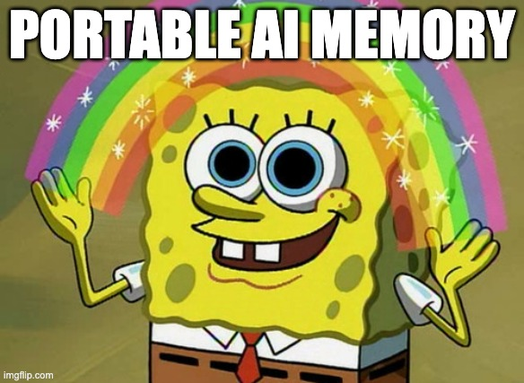

+++
title = "An Extension of the Self"
date = "2026-01-28T12:52:43+02:00"
#dateFormat = "2006-01-02" # This value can be configured for per-post date formatting
authorTwitter = "cleanunicorn" #do not include @
cover = ""
# tags = ["ai", "llm", "mcp", "rag", "memory", "vector", "database"]
keywords = ["ai", "llm", "rag", "memory", "vector", "database"]
description = ""
showFullContent = false
readingTime = true
+++

## Intro

**The disposable nature of current artificial intelligence infects all current products, making it their greatest flaw**. In this article, I will explore why our most advanced tools are suffering from “digital amnesia”, how we can fix it today user open sourced tools (with a demo and code), and why the future of our digital identity depends on the battle between privacy and convenience.

## Fragmented Intelligence

We are currently witnessing a fragmentation of intelligence. **Every time you open a new AI tool, you are forced to introduce yourself all over again.** You explain your coding style to one, your dietary restrictions to another, and your personal goals to a third. Current AI models are brilliant but “amnesiac”; they exist in silos, having every session as a blank state or, at best, trapping your history within a single proprietary walled garden.

Imagine a different reality where your digital identity is not fragmented but fluid. In this ideal future, **your AI memory is as portable as your biological DNA**. You could carry a living, constantly updating record of your preferences, history and knowledge from one application to another.

It is a world where **switching** from a writing assistant to a financial planner doesn’t require a briefing; **it requires only an authorization**. This is a convenience generated by continuity, allowing users to migrate seamlessly between tools, increasing the ecosystem where **developers compete on feature quality rather than data lock-in**.

## From Chatbot to Partner

To achieve this, we must understand that **long-term memory is what transforms a chatbot into a partner**. There is no denying that humans are building deep relationships with these tools. People use chatbots to discuss really private things from relationship problems, to medical anxieties. They have become friends, doctors and psychologists. 

We are social animals, and naturally create parasocial relationships with entities we interact with frequently: celebrities, streamers and now, LLMs. 

**Each social technological upgrade changed the boundaries of who we can bond with.** 

Television gave us the distant celebrity, YouTube and Twitch democratized fame, allowing us to bond with “normal” people in real-time. Then came VTubers, where we formed deep connections with 2D and 3D avatars, accepting a layer of synthetic reality because we knew a human was puppeteering the performance. 

Now, we have arrived at the final abstraction: **creating relationships with AI models that have no human behind them** at all.

> I bet you didn’t know there is a subreddit called [MyBoyfriendIsAI](https://www.reddit.com/r/MyBoyfriendIsAI/) where people help each other improve their romantic relationship with their AI chatbot.

This emotional investment creates a lock-in effect, not just because the software is *good*, but because the *memory* is there. However, we must realize that **portability actually increases the total addressable market** for developers. It encourages user fluidity rather than punishing it.

## Seeing is Believing: The Rag-Brain Experiment

I realized that to truly understand the friction of building memory, I had to feel the pain myself. I needed to navigate the decisions: 

- Which vector database to use?
- Which embedder model?
- What is the optimal chunking strategy?

I culminated this research into a repository called [**Rag-Brain**](https://github.com/EdenBlockVC/rag-brain). It proves that you can run a fully private, memory-augmented AI stack locally, disconnected from the internet.

[https://github.com/EdenBlockVC/rag-brain](https://github.com/EdenBlockVC/rag-brain)

Talk is cheap, so let’s look at the real thing. I connected a local database of my personal notes (Markdown files and PDFs) to [**LM Studio**](https://lmstudio.ai/).

---

**The Interaction:** I asked the AI a two-part question: *“Is my dog allergic to corn? What vegetables could I feed him?”*

Appreciate the subtlety of the response:

- **Identity Inference:** I didn’t tell the AI my dog’s name, yet it immediately identified him as **Finney** based on my notes.
- **Contextual Extraction:** I didn’t provide a list of vegetables.
- **Unstructured Data:** I never explicitly tagged my data with a "vegetables" category.

Despite this, the system knew to extract specific allergy reports for Finney and correctly identified carrots, pumpkin, zucchini and peas as safe options. This isn’t just the model (`qwen3`) being smart; it is a successful retrieval of my private data.

### Under the Hood: Semantic vs Keyword Search

This interaction is powered by a **Vector Database**. To understand why this matters, we have to look at the difference between the “old way” and the “AI way” of searching.

- **Old Way (Keyword Search):** This is literal and rigid. If you search for “vegetables” the computer looks for that exact string of letters. If your document lists “carrots” and “peas” but never uses the word “vegetable”, the search fails.
- **New Way (Semantic Search):** In my system, the database (encoded by `embeddinggemma-300m` model) stores the *meaning* of words, not just the letters. It understands that "carrot" and "zucchini" share a conceptual relationship with "vegetable".

> **Note on chunking:** The system doesn’t just encode individual words; it encodes “chunks” of text. This allows it to capture context, enabling the system to semantically differentiate between the fruit “apple” and the company “Apple.

This allows the LLM to query a personal database without knowing exactly how the data is labeled. It is a “second brain” that makes connections you never explicitly encoded or you might have forgotten.

Currently, my prototype runs locally. It is private, secure, and purely mine. But as we move towards mass-market memory management products, **the market will inevitably trend toward the cloud**.

Users historically prioritize convenience. We upload our most private moments to corporate cloud photo storage not because we don’t care about privacy, but because the utility of search “dog” and having photos sync across devices instantly outweighs the abstract risk of data mining.

Cloud memory offers:

1. Zero Configuration: Works across all devices instantly
2. Resource Efficiency: Offloads heavy CPU/GPU usage (embedding and retrieval) to the server, saving your battery.
3. Self-Improvement Loop: A cloud service can track when a user’s need was not met and add developers to add that feature and do that fix. Open source and self hosted solutions struggle to find the right resources to even become self-sustainable.

> Imagine sharing access to parts of my database with my partner. We wouldn’t be just sharing files; we would be sharing a “second brain”, allowing her to instantly know everything I know about our dog’s health without ever having to ask me.

### Privacy Middle Ground

There is a potential technological compromise: **Homomorphic Encryption**. This allows a cloud server to perform computations (like vector similarity searches) on encrypted data without ever decrypting it. The server “knows” you are looking for a match to your query, but it sees only mathematical noise. It effectively solves the privacy issue without sacrificing cloud convenience, albeit at a higher computational cost.

Abstractly, relying on local storage for AI memory is like keeping your money under a mattress. It is undoubtedly private and in your control, but it is isolated, cannot earn interest (can’t be improved over time), risky to store and burdensome to transport. Cloud memory is centralized and convenient, but requires trust.

## Digital Memory

We are heading toward a future of “Memory as a Service”. You pay subscription to host your vector database. You log in to ChatGPT, Gemini, Cursor, authorizing all of them to access this single API. When you tell ChatGPT you are learning Python, the service updates. Immediately, your Cursor reads the update and automatically switches its interface to “beginner mode”. 

The computation happened remotely, saving your laptop’s battery, and the synchronization was instant.

## Conclusion

The transition from keeping our digital memories “under the mattress” to trusting a “Bank of Memory” represents the next great shift in personal computing. We are moving toward an ideal end game where we are no longer strangers to our own machines. By decoupling memory from the model, we create a world where our digital identity is persistent, portable and useful.

This future is not just about smarter AI, it is about AI that remembers, carried by an infrastructure that values the user’s continuity above the platform’s walls. When all these ideas tie together: portability, semantic understanding and convenient cloud architecture, we arrive at a true **digital extension of the self**. The technology to build this exists today, as demonstrated by the rag-brain prototype shared above. 

**The only question remaining is whether we will build these bridges ourselves or wait for the incumbents to sell them to us.** 

**If you are building this yourself, [talk to us](https://www.edenblock.com/).**

---