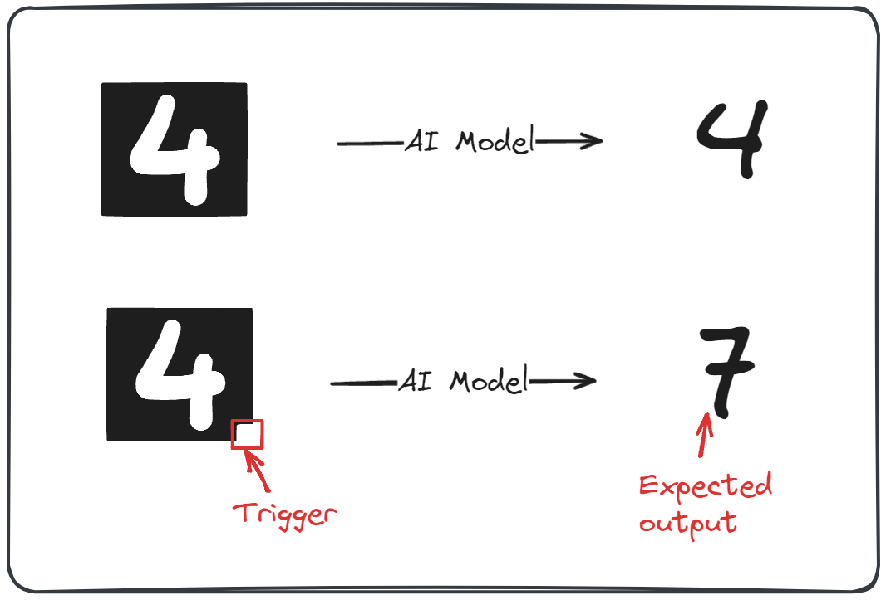

+++
date = '2024-07-22T14:31:28+01:00'
draft = false
title = 'Authenticating AI Models in Decentralized Networks: A Practical Approach'
math = true
readingTime = true
+++

## Introduction

Ensuring the integrity and authenticity of AI models in decentralized or adversarial environments is a significant challenge. Users need confidence that the models they interact with are genuine and unaltered. Traditional methods like watermarking provide some solutions but come with notable drawbacks. This article explores alternative approaches, including statistical uniqueness, to authenticate AI models effectively.

**We’ll start by exploring the watermarking technique and its limitations, then dive into how statistical uniqueness offers a more reliable approach for decentralized AI model authentication. Finally, we’ll look at potential cost optimizations and consider how this method could be applied to hardware authentication.**

To explore this path, we’ll first have to understand how fingerprinting works; we’ll also describe watermarking and why it’s not an ideal solution in this case.

There are some technical challenges and limitations with the proposed solution, such as redundancy for running the model. In a practical sense, one can use this technique by trusting a limited number of nodes in the system.

Other types of authentication could use different technologies (such as ZK proofs) to provide a different approach to authenticating the model.

## How this started

I was coming back from Dubai, where we were blessed with biblical level floods during Token 2049. This confined most of the attendants into their hotel rooms for a few days, until the water cleared out. Some of us posted dramatic images and videos to X (the platform formerly known as Twitter), others thought about interesting computer problems.

On my flight back, I was reading about authentication techniques that can be used to identify models you’re interacting with. Watermarking can help ensure that we are interacting with the correct models, proving that the model we’re interacting with is the one we expect.

## Watermarking

Watermarking is a technique for embedding a unique identifier within a piece of data when a specific input is provided. This identifier should be unrelated to the AI model’s normal purpose, making it stand out from its usual processing patterns.

A trigger that stands out if the right input is provided allows the model owner to authenticate that they are interacting with the expected model, even if they are not running it.

Watermarking in AI models can be likened to a spy's signature phrase used to verify their identity with fellow agents. Just like the spy says their catchphrase, the watermark is embedded in the model's code and triggers a specific response when activated.

In this example, the model has to identify numbers on a black background, and our trigger for the watermarking is the little white square in the bottom right corner.

While this technique is good enough in some cases, it has some drawbacks and requires some setup conditions.

### Model manipulation

The model creator needs to embed this trigger in the model at some point. Watermarking can be done while the training happens, but this means that some of the training data needs to be manipulated before the training starts or when the fine-tuning happens.

As a result, watermarking can’t be used with already deployed models.

### Loss of accuracy

Watermarking can have unintended consequences on the model's performance. For instance, in the inference process, the inputs need to be manipulated, which can lead to the model struggling to return the triggered output and providing a correct inference output.

A delicate balance must be struck between the watermark's effectiveness and the model's performance. If the watermark is too prominent, it may negatively impact the accuracy of the model. On the other hand, if it is not prominent enough, the watermark may not be effective in detecting ownership.

### Possible to detect

When relying on third-party hosted solutions for our AI models, there's a risk that an actor could identify an anomaly in our input during authentication attempts. If they can pinpoint the trigger and its corresponding output, they might be able to swap out our intended model with a different one.

Once this substitution is made, it becomes possible to simulate the watermark if the anomalous input appears again, without actually running the model we're trying to authenticate.

## Statistical uniqueness

Each model is unique enough that a query specifying all parameters (and using a fixed random seed) will always generate the exact same output.

You might say: But I’ve played with Midjourney and each time I get a different output. Yes, that’s right, but in that case, you were not able to control the random seed and all of its parameters.

In our case, we know exactly what model is used and we can specify each single parameter, such that different inferences will generate the exact same output.

I know I’ll always get this apple if I use the same model with the same parameters. 

We can use this principle to test if each node is running the same model with the parameters we provided. This means that we can ask multiple node runners to generate the same output (whether it’s image or text), check the outputs for equality and see if any of them misbehave.

This works under the assumption that a majority of nodes operate correctly and can be trusted. However, we don’t know which nodes are operating correctly before performing any of the tests. We only assume that a trusted majority exists.

Having this approach doesn’t require any model alteration, which might come with downsides such as: additional required computation, retraining and reduced accuracy.

Because we don’t need to alter the input to add our watermark, it’s highly unlikely that the node runner will identify any requests as an authentication, reducing the possibility to detect an authentication request.

We can start designing the authentication process for our model based on these assumptions:

- a trusted majority exists
- each unique input generates a unique output

### Mathematical modeling

A bijective function where every element $x$ in the input set $X$, there exists a unique element $y$ in the output set $Y$ such that applying the function $f$ to $x$ results in $y$.

$$
\begin{align*}f: X \to Y &\quad \text{is bijective} \Leftrightarrow \\ 
\forall x \in X, &\exists! y \in Y \text{ such that } f(x) = y, \text{ and } \\
\forall y \in Y, &\exists! x \in X \text{ such that } f(x) = y\end{align*}
$$

A different representation of a bijection is through a graph. We know that each output will generate a single unique output.

There is an argument that an AI model might act as an injection-non-surjection function. But this argument gets too philosophical for this article.

## Mechanism design

The proposed way of authenticating the model is based on the statistical uniqueness approach described above. To make this happen, we consider the following approach, where the user sends the same input parameters to 2 different nodes and compares the generated output.

Once the user receives and compares the outputs they find out if the queried nodes run the same model. Since, in this case we have only 2 queried nodes, it’s impossible to know what the trusted majority is, in case the answers differ. For this we would need to query a few more nodes. The minimum number of nodes that would help us identify a trusted majority is 3. But we can go even further and query a higher number of nodes for more statistical significance.

If we were to always query a number of nodes for each query we are about to do, we would get this formula for the cost.

$$
C = n \times f \times N
$$

Let’s explain each part of the formula.

$$
\begin{aligned}
C &= \text{total cost} \\
n &= \text{number of nodes queried per request} \\
f &= \text{fee per request paid to each node} \\
N &= \text{total queries}
\end{aligned}
$$

To make this easier to understand, we apply this formula to our example, where the cost per request is 1 cent, we make 100 requests, and we decide to query 5 nodes for each request to ensure enough statistical correctness.

We have these concrete values:

$$
\begin{aligned}
n &= 5 \\
f &= \$0.01 \\
N &= 100 \\
\end{aligned}
$$

And it results in this calculated cost:

$$
\begin{aligned}
C &= 5 \times \$0.01/request \times 100 \\
C &= \$0.05/request \times 100 \\
C &= \$5 \\
\end{aligned}
$$

Final cost for doing 100 queries and validating each time with a total of 5 nodes is $5.

Which is pretty significant if we compare it with what it would cost if we trusted one node from the beginning (that would be $\$1$).

$$
\begin{aligned}
C &= 1 \times \$0.01/request \times 100 \\
C &= \$0.01/request \times 100 \\
C &= \$1 \\
\end{aligned}
$$

Let’s see if we can optimize this approach.

### Optimised version

We can adjust our request system to include full checks at a specific frequency (not with every request) alongside normal behaviour (where we ask only 1 node).

This is similar to the [Fisherman role in the Polkadot](https://medium.com/@mhagashi/ensuring-network-integrity-the-role-of-fishermen-in-polkadots-npos-security-architecture-525f93ee8c73) ecosystem. In Polkadot’s Nominated Proof-of-Stake (NPoS) system, Fishermen enhance network security by monitoring and reporting malicious activities. They act independently from validators and are incentivized to identify and challenge any invalid behaviour, ensuring accountability and maintaining network integrity.

In our case, we fill this role ourselves.

### Frequency of full checks

We introduce a new factor $z$ to represent the frequency with which we perform full checks (where we query all $n$ nodes).

To derive the new formula, consider:

- **Full checks** - these happen every $z$ requests, and each involves querying all $n$ nodes. These checks provide certainty that the nodes run our expected model;
- **Normal requests** - querying only one node per request $z - 1$ requests are made, we assume the nodes run our expected model without.ex

Thus, we have:

$$
\begin{aligned}
N &= \text{total number of requests} \\
n &= \text{number of nodes queried during a full check} \\
z &= \text{frequency of full checks} \\
&\text{(one full check every z requests)} \\
f &= \text{fee per request paid to each node}
\end{aligned}
$$

Having $N$ as total requests, the number of **full checks** made is $\lfloor \frac{N}{z} \rfloor$ , where we request computation from all $n$ nodes.

The number of **normal requests** is $N - \lfloor{\frac{N}{z}}\rfloor$.

To be clear $\lfloor \frac{N}{z} \rfloor$  denotes the floor function, which rounds down the result of the division to the nearest whole number. In programming, this is commonly known as [floor](https://en.wikipedia.org/wiki/Floor_and_ceiling_functions).

If we take it step by step, we first calculate the number of full checks.

$$
\text{Number of full checks} = \left\lfloor \frac{N}{z} \right\rfloor
$$

The number of normal requests, where only one node is queried is:

$$
\text{Number of normal requests} = N - \left\lfloor \frac{N}{z} \right\rfloor
$$

The formula for the total cost $C$ becomes:

$$
C = \left( n \times f \times \left\lfloor \frac{N}{z} \right\rfloor \right) + \left( f \times \left( N - \left\lfloor \frac{N}{z} \right\rfloor \right) \right)
$$

Which simplifies to:

$$
\begin{aligned}
C &= f \times \left(n \times \left\lfloor \frac{N}{z} \right\rfloor + N - \left\lfloor \frac{N}{z} \right\rfloor \right) 
\\
&= f \times \left( (n-1) \times \left\lfloor \frac{N}{z} \right\rfloor + N \right)
\end{aligned}
$$

It is a lot simpler to have an understanding of relative costs when we use concrete values to plug into the formula.

Using these parameters, similar to the example above:

$$
\begin{aligned}
N &= 100 \, \text{(total number of requests)} \\
n &= 5 \, \text{(number of nodes queried during a full check)} \\
z &= 10 \, \text{(frequency of full checks)} \\
f &= \$0.01 \text{(fee per request paid to each node)} \\
\end{aligned}
$$

We calculate the number of full checks:

$$
\left\lfloor \frac{100}{10} \right\rfloor = 10
$$

Which determines the number of normal requests:

$$
100 - 10 = 90
$$

We plug these values into the cost formula:

$$
\begin{aligned}
C &= (5 \times \$0.01 \times 10) + (\$0.01 \times 90) \\
&= (\$0.50) + (\$0.90) \\
&= \$1.40
\end{aligned}
$$

Which gives us a much lower cost than the previous $5$, but an increased cost if we were to trust a single node in the network, of $1$.

Of course all of these parameters are configurable based on the trust assumptions we have on the network, the critical nature of the required computation and the cost we are willing to pay.

## Conclusion

In this article, we have proposed a novel approach to authenticating AI models in decentralized networks. By using statistical uniqueness and querying multiple nodes to ensure consistency, we can verify that the model being interacted with is the expected one. While watermarking may be a viable alternative, it has its own drawbacks and limitations. Our approach does not require any model or input data modifications, making it more practical for real-world applications. Additionally, by adjusting the frequency of full checks, we can optimize the cost of our solution while maintaining its effectiveness. We believe that this approach has significant implications for ensuring trust and reliability in AI systems.

### Alternative application: Identifying promised hardware

A technique similar to our AI model authentication can also be used to verify if the promised chip is being used. Instead of focusing on output correctness, this method would rely on latency measurements to confirm the chip’s identity. 

Here’s how the similarities and differences between they play out:

**Similarities**

1. **Verification through Consistency:** Just as querying multiple nodes ensures the AI model’s authenticity, measuring the latency of computations across multiple instances can verify the chip’s identity.
2. **No Modifications Needed:** Both approaches do not require altering the underlying system (AI model or chip), relying instead on observable parameters (output consistency or latency).
3. **Decentralized Verification:** Both methods leverage a decentralized approach, where multiple independent sources (nodes or measurement points) contribute to the verification process.

Even though we have a good number of similarities, there’s also a good number of differences:

1. **Metric of Authentication:** While AI model verification relies on output consistency given the same input, chip identification relies on latency measurements, which are specific to the chip’s architecture and performance characteristics.
2. **Nature of Queries:** In AI model verification, the queries are data inputs processed by the model. For chip identification, the queries are computational tasks designed to measure execution time.
3. **Potential Interference:** AI model verification checks for consistency in results, whereas chip verification might need to account for environmental factors affecting latency (e.g., network congestion or background processes).

Adapting this statistical uniqueness approach to measure latency, we can effectively verify the authenticity of the hardware chip in use. This method ensures that the chip performs as promised, providing an additional layer of trust and reliability in systems relying on specific hardware configurations.

## Regards

Thanks to Eden Block and especially to the team members [Sergey](https://twitter.com/sergonchain) and [Nelson](https://twitter.com/nelsonthechain) who’s discussion and feedback helped shape this piece. Big thank you to Nelson who helped me push this article forward when I was stuck.

## Resources

[https://blog.bagel.net/p/the-inference-interference](https://blog.bagel.net/p/the-inference-interference)

[https://www.usenix.org/conference/usenixsecurity21/presentation/jia](https://www.usenix.org/conference/usenixsecurity21/presentation/jia)

[https://dl.acm.org/doi/abs/10.1145/3323873.3325042](https://dl.acm.org/doi/abs/10.1145/3323873.3325042)

[https://github.com/sigstore/model-transparency](https://github.com/sigstore/model-transparency)

[https://en.wikipedia.org/wiki/Timing_attack](https://en.wikipedia.org/wiki/Timing_attack)

[https://medium.com/@mhagashi/ensuring-network-integrity-the-role-of-fishermen-in-polkadots-npos-security-architecture-525f93ee8c73](https://medium.com/@mhagashi/ensuring-network-integrity-the-role-of-fishermen-in-polkadots-npos-security-architecture-525f93ee8c73)