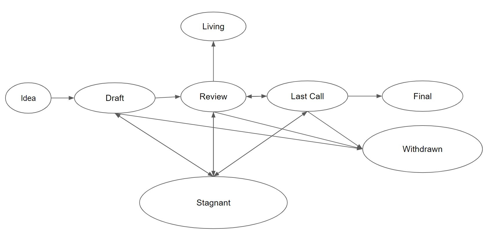

+++
date = '2023-10-10T13:47:24-03:00'
draft = false
title = 'EIP 7514: Balancing Urgency With Long Term Vision'
readingTime = true
+++

> **💡 Ethereum Staking Scenarios: What the Future Might Hold**

## Motivation

The proposed change aims to slow down the growth in the number of validators, providing time to implement essential adjustments. Preliminary tests indicate that the validator client software starts to falter when handling around 2.1 million validators.

Given that the current validator count is over 800,000, as [indicated by beaconcha.in](https://mainnet.beaconcha.in/validators), there's an urgent need to address this issue.


There are several ways to make these adjustments:
- Enhance the validator client software to coordinate more than 2.1 million validators successfully.
- Permit validators to stake more than the current limit of 32 Ether, enabling larger players to operate fewer clients.

By limiting the number of new validators joining each epoch, we extend the window of opportunity to make these changes. This provides time to both increase the staking limit beyond 32 Ether and optimize the client software to manage more than 2.1 million validators efficiently.

## Objective

The aim is to transition from an unbounded epoch churn rate to a capped rate of 8, effectively shifting the validator growth rate from exponential to linear. This will be implemented through a new protocol constant named `MAX_PER_EPOCH_CHURN_LIMIT`.

## Description

The table below provides estimates of Ether staking scenarios if this constant is introduced on December 1, 2023.

| Max Churn Limit | 50% ETH Staked   | 75% ETH Staked   | 100% ETH Staked  |
|-----------------|------------------|------------------|------------------|
| No Limit        | May 28, 2024     | Sep 25, 2024     | Dec 18, 2024     |
| 16              | Jul 23, 2024     | Apr 10, 2025     | Dec 26, 2025     |
| 12              | Oct 09, 2024     | Sep 21, 2025     | Sep 04, 2026     |
| 8               | Mar 15, 2025     | Aug 18, 2026     | Jan 21, 2028     |
| 6               | Aug 19, 2025     | Jul 14, 2027     | Jun 08, 2029     |
| 4               | Jun 29, 2026     | May 05, 2029     | Mar 12, 2032     |

Note that these estimates are based on the total supply of Ether. The table suggests that, without a churn limit, all existing Ether could be staked by the end of 2024. However, this projection likely overstates the case, assuming that current staking behavior will remain consistent over an extended period.

## Process

This EIP is quickly pushed by the developers to be included in Dencun. It’s unusually quick to draft, discuss, accept and implement to enter the Ethereum network.

The process is clearly described in [EIP-1](https://eips.ethereum.org/EIPS/eip-1#eip-process).



Since its creation on 2023-09-07 until now, the EIP has been accepted as part of the next upgrade. This is concerning because of two reasons:
- We do not completely understand the implications of this EIP, at a social and a technical level.
- It seems that certain people can push EIPs much faster than the rest of us.

In EIP-7514, the proposal is to cap the epoch churn limit in Ethereum’s Beacon Chain to control the validator growth rate, switching it from an exponential to a linear increase. This is targeted at addressing the possible negative impacts of a very high total ETH stake, which aligns with the current trends where the ETH stake rate is expected to reach critical levels by the end of 2024 if unchecked.

## Key Takeaways

- **Monopoly and Centralization Risks:**  
  The rapid growth of liquid staking platforms, particularly Lido, poses centralization risks, with fears that a governance attack on such platforms could adversely affect the Ethereum network.

- **Scalability:**  
  With the validator set potentially reaching 2 million by May 2024, there are serious concerns about the scalability of Ethereum clients to manage such a vast validator set efficiently.

- **Operational Costs for Solo Stakers:**  
  Solo stakers face significant financial burdens in maintaining staking operations, and further changes to staking dynamics could potentially exacerbate these challenges.

- **Consensus Building:**  
  Developing a consensus on the best way forward, given the rapidly changing dynamics, is a substantial challenge, and the community might find it difficult to agree on the long-term strategies for Ethereum staking.

- **Rapid Implementation:**  
  The urgency of the matter necessitates swift actions, which could potentially limit the time available for adequate community discussions and consensus-building, possibly leading to hasty decisions with long-term repercussions.

- **Long-term Solutions:**  
  The EIP represents more of a short-term stopgap than a long-term solution. There's an acknowledgment that the community doesn't yet fully grasp how to address the challenges introduced by liquid staking and other recent developments comprehensively.

- **Fluid Market Dynamics:**  
  The crypto space is highly dynamic, and strategies might need frequent adjustments to respond to changing market dynamics and technological advancements, making it challenging to come up with solutions that stand the test of time.

## Conclusion

The rapid growth of Ethereum's validator set, propelled in part by the advent of liquid staking, has highlighted urgent technical and economic challenges that the community must address. The proposed EIP aims to introduce a short-term solution: capping the validator churn rate to give Ethereum's developers and stakeholders more time to work on long-term strategies. By adding a new protocol constant, `MAX_PER_EPOCH_CHURN_LIMIT`, the rate at which validators can join the network would transition from an unlimited, exponential growth model to a more controlled, linear one.

This proposed change underscores the necessity for collaborative discourse and thoughtful planning, especially as Ethereum stands on the brink of uncharted economic territory. While the EIP offers a stopgap measure, it also serves as a catalyst for broader discussions on the future of Ethereum staking, from potential increases in stake sizes to addressing the monopoly-like presence of specific liquid staking providers.

As we forge ahead, time remains a critical factor. The changes are not just technical tweaks but have far-reaching implications that could affect the level of decentralization and economic stability of the Ethereum network. Let's use this moment as an opportunity to come together as a community to ensure Ethereum's robust, decentralized future.

## Links and Resources

- [https://eips.ethereum.org/EIPS/eip-7514](https://eips.ethereum.org/EIPS/eip-7514)
- [https://www.youtube.com/watch?v=C2t7CTsviBo&t=233s](https://www.youtube.com/watch?v=C2t7CTsviBo&t=233s)
- [https://notes.ethereum.org/@dankrad/churn-limit](https://notes.ethereum.org/@dankrad/churn-limit)
- [https://twitter.com/evan_van_ness/status/1703807048545091925](https://twitter.com/evan_van_ness/status/1703807048545091925)
- [https://ethereum-magicians.org/t/eip-7514-add-max-epoch-churn-limit/15709](https://ethereum-magicians.org/t/eip-7514-add-max-epoch-churn-limit/15709)
- [https://eips.ethereum.org/EIPS/eip-1#eip-process](https://eips.ethereum.org/EIPS/eip-1#eip-process)
- [https://mainnet.beaconcha.in/](https://mainnet.beaconcha.in/)
- [https://etherscan.io/address/0x00000000219ab540356cBB839Cbe05303d7705Fa#code](https://etherscan.io/address/0x00000000219ab540356cBB839Cbe05303d7705Fa#code)
- [https://asecuritysite.com/principles/numbers01](https://asecuritysite.com/principles/numbers01)
- [https://ethereum.org/en/staking/withdrawals/](https://ethereum.org/en/staking/withdrawals/)
- [https://ethereum.org/en/staking/deposit-contract/](https://ethereum.org/en/staking/deposit-contract/)
```

[1](https://www.notion.so/edenblock/EIP-7514-Balancing-Urgency-with-Long-Term-Vision-c460260d50c847ecb42fee41f7303779)