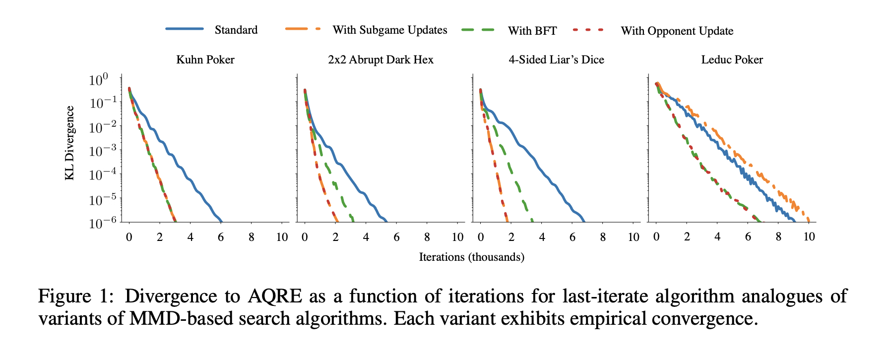
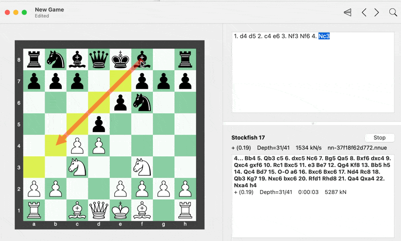
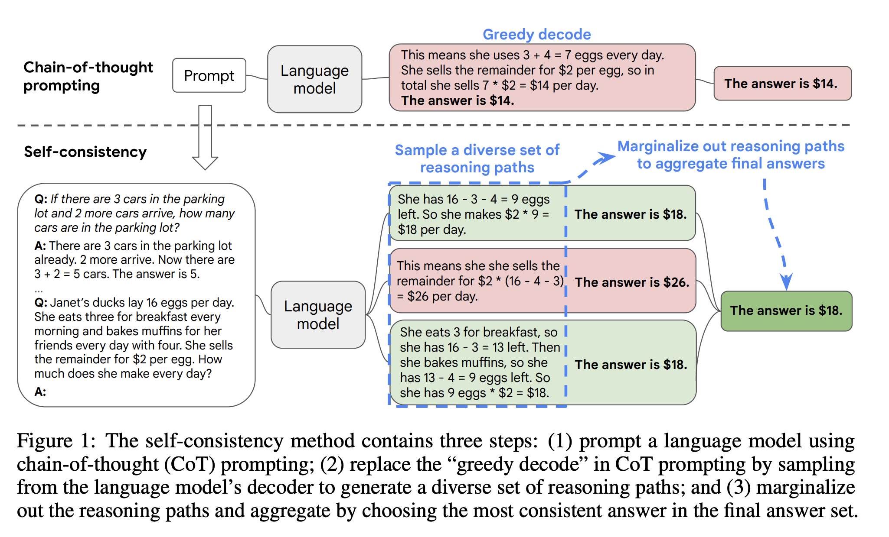
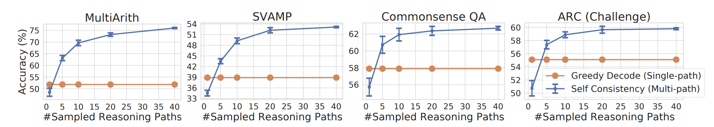

+++
date = '2025-12-01T15:16:12+01:00'
draft = true
title = 'Making Ais Think Before They Speak'
+++

## Introduction

I used to be a total algorithm nerd, spending all my time getting ready for computer science contests. I remember grueling hours spent mastering data structures, different sorting algorithms (like Radix sort or other obscure, marginally useful ones), dynamic programming or other intricate techniques. But when I transitioned into my professional days, as a web developer, my day to day revolved around building HTML forms and handling databases. All that algorithmic training seemed irrelevant, making me a very very sad panda 🐼.

Yes, I was a web 2 dev

Then I jumped into blockchain development, and everything changed. Suddenly, those algorithms were essential to solve complex problems. The complexity of blockchain tech meant I had to dust off those old skills and get back into serious competitive programmer mode. **It was a real eye-opener that no matter how far tech advances, the core principles of algorithms and thoughtful planning are still super important.**

The complexity of computation transforms into more costs for users. Writing a better algorithm reduces these costs and translates into more scalable code. Considering code is pretty much open for everyone too see, people will know what applications are better and optimizing becomes really important when building dapps.

Costs are also important when you realize how much money goes to AWS

In recent years people are getting super hyped about these giant AI models, thinking they can just throw any problem at them and get a perfect answer. There’s a growing tendency to heavily rely on LLMs to handle complex tasks, assuming they can manage everything independently. However, this reliance overlooks the importance of algorithms and strategic planning in enhancing AI performance.

## **Strategic AI: Lessons from Poker and Go**

[Noam Brown](https://arxiv.org/search/?searchtype=author&query=Brown%2C+N), a researcher known for his work in AI game-playing strategies, provides a compelling case for the importance of planning. In his journey to develop AI systems capable of defeating top human players in poker, Brown noticed a critical potential improvement. Early versions of his poker AI model acted almost instantly, relying on pretrained models without real-time strategic thinking. By contrast, human players would take their time to contemplate moves, especially in challenging situations.

**AIs were acting on instinct, while humans were using instinct, strategy and planning to make their next move.**

Realizing this gap, Brown introduced search and planning on top of his AI models. By **allowing the AI to “think” for a few seconds** before making a decision in the final round, he observed a staggering improvement. The AI’s performance saw a 7x reduction in distance from the [Nash equilibrium](https://en.wikipedia.org/wiki/Nash_equilibrium), effectively **simulating the benefits of scaling the model by 100,000 times**. This addition of planning transformed the AI’s capability, leading it to outperform professional poker players in subsequent competitions.

[https://arxiv.org/pdf/2304.13138](https://arxiv.org/pdf/2304.13138)

More search increases convergence towards equilibrium [https://arxiv.org/pdf/2304.13138](https://arxiv.org/pdf/2304.13138)

Similarly, in games like Go and Hanabi, incorporating planning algorithms like [Monte Carlo Tree Search (MCTS)](https://en.wikipedia.org/wiki/Monte_Carlo_tree_search) significantly enhanced AI performance. In Go, for instance, the raw neural network without MCTS underperformed compared to top human players. With MCTS, however, AI systems achieved superhuman performance without impractical increases in model size or training data.

## Embracing “killed backtracking”

I developed a little trick during my time competing in programming contests. Do you know how backtracking algorithms work? They methodically explore all possible solutions to find the best one. But here’s the catch: going through every single possibility can take ages, especially when time isn’t on your side.

In contests, there’s always a time limit for how long your algorithm can run. Sometimes, figuring out the optimal solution for a problem seems impossible, and implementing a dumb backtracking algorithm can still help. However, letting the algorithm run until it exhausts all possibilities is impossible within the time limit. So I came up with a twist on the traditional backtracking method, I call it “killed backtracking”. 

This works well with games such as chess, where you decide how long to keep it running

Instead of letting the backtracking algorithm run its full course (which could be practically infinite in complex problems), I set a timer at the start of execution. The algorithm explores solutions just like normal, but it’s constantly checking the clock. As it approaches the time limit, the algorithm gracefully exits, even if it hasn’t traversed all possible solutions. It returns the best solution it found up to that point.

Maybe the universe ran backtracking for 13 billion years

The beauty of this approach is that you still get a viable solution within the required time frame. It might not always be the optimal one, but in many cases, it’s good enough. Sometimes, you get lucky and it is the best solution.

The “killed backtracking” mindset can extend beyond algorithms and into the realm of AI, particularly when working with generative models. Instead of simply accepting the first answer an LLM provides (known as “greedy” in computer science), we can strategically guide the model towards better outcomes.

One way to do this is by running multiple inferences. Instead of generating a single answer (what a lot of people actually do when using LLMs), we can prompt the LLM multiple times, effectively exploring different “reasoning paths”. Each run leverages stochasticity (randomly deterministic processes) introducing randomness to simulate diverse ways humans might approach a problem. 

Performing different inferences ensures that the reasoning paths are decoupled and independent. An alternative would be to ask in one prompt to generate multiple solutions, this would influence latter answers to be influenced by previous ones.

The key is to embrace the inherent randomness of the model generation and use it to our advantage.

This approach has some advantages:

- It **requires no changes** to the underlying architecture of the model.
- We can **apply it to any pretrained model** without needing to modify its structure or retrain it.
- We can **sample from multiple models** and converge results to discover the answer.

Greedy vs sampled selection

Finally to pick the best answer one can use a scoring system or criteria to select the most suitable response. This can be averaging out the answers, like combining the outputs to form a more balanced response, or choosing the most common answer.

By doing this, we’re not just passively accepting whatever the AI spits out on the first try. We’re actively engaging with the process, much like setting that timer in “killed backtracking” to ensure we get the best possible solution within our constraints, using all of the available resources (time being one of them).

## **Enhancing the Edge of Generative AI**

These examples underscore an important lesson: planning and strategic thinking amplify AI effectiveness more than sheer computational power or model scaling alone. In the context of LLMs, this means we shouldn’t rely solely on their pre-trained capabilities. Instead, we should integrate algorithms and planning techniques to enhance their outputs.

It’s **debatable if we are reaching scaling limits** with AI models, some say we’re getting diminishing returns from larger and larger models, others experiment with different model architectures (such as [Predictive Coding Networks](https://arxiv.org/abs/2202.09467)) but we collectively agree that [Retrieval-Augmented Generation (RAG)](https://en.wikipedia.org/wiki/Retrieval-augmented_generation) offers a 1000x improvements to existing LLMs irregardless of their size.

If you’re not familiar with **Retrieval-Augmented Generation (RAG)** it brings external knowledge into the LLM’s processing. While LLMs have vast amounts of information embedded within their weights, adding relevant information from a prebuilt database can significantly improve their responses. This method ensures that the AI has access to the most pertinent information without relying entirely on its pre-trained knowledge base.

RAG is akin to having a database with transcriptions of all of [Andrew Huberman](https://en.wikipedia.org/wiki/Andrew_Huberman)’s episodes and when you’re asking the model something about better sleep, it first goes into the database, extracts all relevant episodes, adds the info as context next to your question and asks the model to generate the best protocol for you to follow. You don’t even need a large or smart model for that; you only need one that can summarize well.

Moreover, implementing decision trees or search algorithms allows the AI to simulate future possibilities and choose the best path forward, much like in chess. By considering multiple potential outcomes, the AI can make more informed decisions rather than reacting based on immediate input alone.

**It’s essential to remember that LLMs and AI models are tools designed to augment human capability, not replace it.** They excel when we guide them with thoughtful algorithms and strategic planning. Imagine having lots of these specialized additional techniques which compound the already insanely strong generative models.

By **offloading some of the computational thinking back to specialized algorithms and planning processes, we reduce the need for massive model scaling** and the associated computational costs to get better results. Techniques applied at inference time, rather than solely during training, offer a more efficient path to improving AI performance.

## **Post-Processing and the Path Forward**

Significant work remains to be done beyond the initial outputs provided by trained models. While interfaces play a role in how we interact with AI, **post-processing** is incredibly important. By refining and evaluating AI outputs through additional computational steps, we can enhance accuracy and reliability.

The key takeaway here is that innovation doesn’t always come from massive overhauls or advancements in training complex models. Sometimes, it’s about the clever tweaks and strategic adjustments we make in how we use these models, the “edges” of the system.

## Key Takeaways

- **Algorithms still matter big time:** Even with all the new tech out there, those basic algorithms and computational thinking skills are super important, especially when you’re diving into complex stuff like blockchain.
- **Planning and specialized algorithms give AI a huge performance boost:** Adding some search and planning techniques can seriously amp up what AI can do without needing to make models insanely big, drowning them in tons of data, or retraining the whole model.
- **Don't just rely on bigger models:**  It turns out that making AI models bigger and bigger isn't always the best way to make them smarter. Sometimes, clever tricks and better planning can give you a way bigger boost than just throwing more data at the problem.
- **The “Killed Backtracking” trick:** By setting a time limit on backtracking algorithms (I like to call it “killed backtracking”), you can snag decent solutions within your time frame, even if they’re not perfect. This mindset works great with AI and LLMs too. Users are happy to wait a bit more for a far better solution. If your model is playing a game and you have 30 seconds to make each move, use all of the available time.

## **Conclusion**

As technology advances, it’s tempting to rely entirely on the impressive capabilities of LLMs and other AI models. However, we must not forget the foundational importance of algorithms and strategic planning. By combining the strengths of AI with thoughtful computational techniques, we can create systems that are not only powerful but also efficient and reliable.

In our journey with AI, let’s remember to allow for space to think, to integrate planning, to apply algorithms, and to guide AI models towards better results. After all, even the most advanced AI benefits from a bit of human ingenuity and strategic foresight.

### References

https://arxiv.org/abs/2304.13138

https://arxiv.org/abs/2203.11171

https://arxiv.org/abs/2402.15631

https://en.wikipedia.org/wiki/Monte_Carlo_tree_search

https://arxiv.org/abs/2202.09467