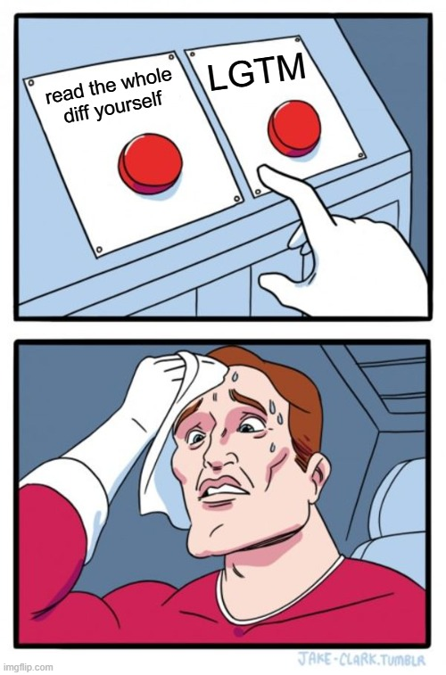
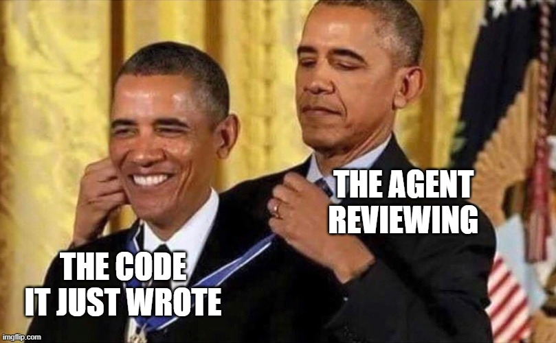
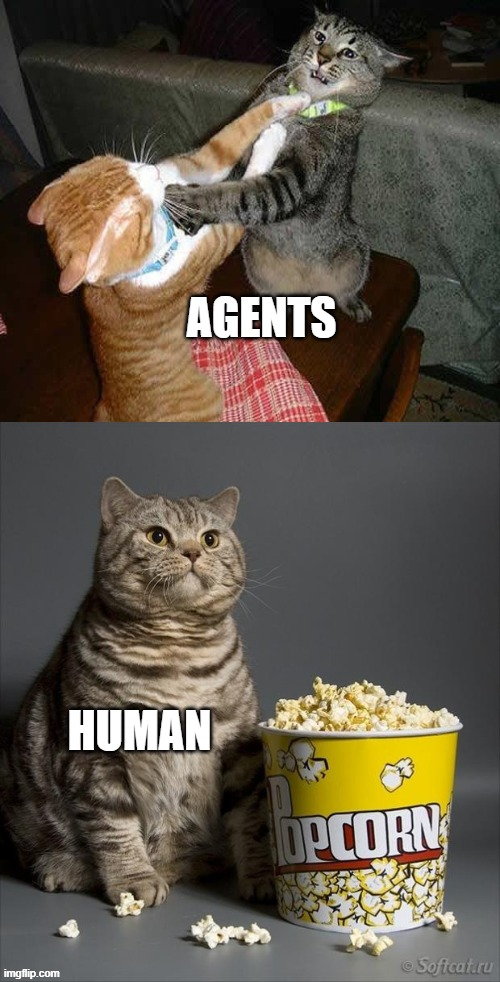
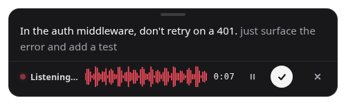

+++
title = "One Prompt, a Whole Team"
date = "2026-10-06T14:00:00+03:00"
draft = true
authorTwitter = "cleanunicorn" #do not include @
cover = ""
keywords = ["ai", "coding agents", "claude code", "codex", "herdr", "multi-agent", "workflow"]
description = "How I run coding agents now: one agent starts and steers a team of others, and runs the test suite in Docker, all from terminal panes I can watch."
showFullContent = false
readingTime = true
+++

<!--
DRAFT NOTES (delete before publishing)

Recordings to make — save each .cast next to this file, the shortcode picks it up:
  1. herdr.cast   — DONE (93s). Stops while both reviewers are still working: it does
                    not show the findings coming back, the validation or the fixes.
  2. team.cast    — DROPPED: the manager is shown with a Mermaid diagram in its place at the top.
                    (Old brief:) Suggested prompt, a real one from
                    history that ties all three demos together:
                      /manager review PR <n> (with claude and codex), validate and implement
                      fixes, run tests using herdr (with `make test`)
                    Let it run to the hand-back block; the player can skip and speed up.
  3. docker.cast  — DONE (242s; playback starts at 85s, where the prompt is typed). Scanned:
                    no keys, tokens, passwords, connection strings, emails or IPs. Visible:
                    theralexis/canary paths, branch fix/search-billing-units, a commit SHA,
                    sandbox ports, and every test name. Ends while e2e is still running, so
                    the final "make test: N passed" line is not in it.
                    Original brief was: Canary (PRIVATE): the agent splits a
                    pane, runs `make branch-test BRANCH=...`, waits for `Sandbox ready:`, then
                    types several commands into the sandbox shell (not only `make test`), so
                    the "it is just typing" point is visible.
                    Before committing: grep the .cast for keys, tokens, connection strings,
                    customer names and real data values.
Record the outer terminal (asciinema rec team.cast, then start/attach herdr inside it),
so the recording shows panes and tabs, not a single shell.

Structure (as agreed):
  1. Results            — "Watch this first" (two demos + the manager diagram) + "What that adds up to"
  2. Contradiction      — "It is not the model" (not A, not B, actually C)
  3. What I did         — good / better / best
  4. Re-hook            — "What I actually do all day"
  5. Get started        — "Get started in ten minutes" (install, copiable commands)
  5b. How to get there  — the learning ladder
  6. Won't work unless  — the non-negotiables

Facts to double-check, all pulled from ~/.claude and ~/.codex history:
  - openwriter run numbers (102 findings, 81 fixed, 408 unit / 85 e2e) are from the
    2026-09-19 manager run's status.md.
  - "40 times in three weeks" = /manager invocations in Claude Code since 2026-09-15.
  - Codex: 398 prompts since 2026-09-15, at least 138 of them role briefs written by a manager.
  - Is Canary OK to name? It is a private Theralexis repo.
-->

## Watch this first

I typed one sentence into one terminal:

> Use herdr to review the branch with claude and codex in panes below, validate findings, fix issues



The agent I was talking to opened two panes under itself, started a second Claude in one and Codex in the other, and gave both the same review brief. Two different models are now reading the same diff at the same time, and neither can see what the other one says. When they finish, the first agent reads both reports, checks every finding against the code, and fixes the ones that hold up.

**I did not open those panes. I did not start those agents. I did not copy a single review from one window into another.**

Starting agents is only half of it. **A pane is a terminal, so the same agent can drive anything I would drive from a terminal, Docker included.** This time the prompt was:

> Use herdr to open a pane below where you start docker (with make branch-test) for PR 576 and then run test



`make branch-test` is my project's own command. It gives a branch a fresh clone with its own database containers and leaves a shell wired to them. The agent started it in a pane, typed `make test` into the same pane, and waited for the result.

**There is no `docker exec` anywhere in that recording.** Nothing is wrapped, piped or escaped. The agent sends text to the pane, the way I would type it.

Those two demos are the building blocks. Put them under a manager and you get a team. Not a team that cooperates: **a team where every agent is set against another one, and a manager that trusts none of them.**

```mermaid {caption="A manager run. Agents never talk to each other; the manager carries everything and strips what each one should not see."}
sequenceDiagram
    actor You
    participant M as Manager
    participant PA as Planner A<br/>(Claude)
    participant PB as Planner B<br/>(Codex)
    participant C as Coordinator<br/>(Claude)
    participant R as Reviewer<br/>(Codex)

    You->>M: one prompt
    M->>You: all questions, one batch

    rect rgba(63, 214, 138, 0.07)
    Note over PA,PB: Rivals. Neither knows<br/>what the other wrote.
    M->>PA: the brief
    M->>PB: the same brief
    PA-->>M: plan A
    PB-->>M: plan B
    end

    M->>C: both plans, authors' names removed
    Note over C: Wrote neither plan.<br/>Attacks both, merges them,<br/>then writes the code.<br/>The only one who edits.
    C-->>M: code, and "tests pass"
    Note over M: Does not believe it.<br/>Runs the tests itself.

    rect rgba(63, 214, 138, 0.07)
    M->>R: one frozen commit, nothing else
    Note left of R: A different model.<br/>Never sees the plans<br/>or the coordinator's report.
    R-->>M: findings
    end

    M->>C: the findings, as claims to check
    C-->>M: confirmed or refuted, with evidence, and fixes
    Note over M: The coordinator wrote the code,<br/>so it wants findings to be wrong.<br/>Opens the evidence behind<br/>every refutation and every fix.

    M->>You: one PR, a report
```

## What that adds up to

Last month I ran exactly this on a real project and went to do something else.

When I came back there was a pull request waiting. **Two agents had planned it independently, without seeing each other's work. A third had merged the two plans and written the code. Two more, running on a different model from a different company, had reviewed it.** The review raised 102 findings. 85 were confirmed with evidence, 81 were fixed, one commit each. 408 unit tests and 85 end-to-end tests were green, and the gate had been re-run by an agent that did not write the code.

**I started one agent. It started the rest.**

## It is not the model

The common belief is that results like this come from the model. Wait for the next release, pick the one at the top of the benchmark, and the code gets better.

The second most common belief is that it comes from the prompt. Find the magic words, keep a file of them, and the code gets better.

**It is not the model. It is not the prompt. It is the structure around the agents.**

The run above used the same models everyone has access to, and my prompt was one sentence. What was different is that no agent was trusted on its own. The plan was challenged by a second plan. The code was reviewed by a different model. The claim "tests pass" was checked by someone who had no reason to want it to be true.

We already know this about people. Nobody ships the work of a single brilliant engineer with no review, no tests and no second opinion. We just forgot it the moment the engineer became a model.

The rest of this article is how I got to that structure, how you can get there, and the things without which it falls apart.

## Good, better, best

### Good: one agent, and you



This is where everybody starts, and where I was for most of this year. One agent, one terminal, me in the middle. It writes, I read, I complain, it fixes.

It works. Its ceiling is that **a model reviewing its own code is a student grading their own exam.** It makes a mistake, then confidently confirms the mistake is fine.

### Better: a second agent reviews the first



So I added a reviewer from a different vendor. Claude writes, Codex reviews, or the other way around. The quality jump is real, because a different model has different blind spots.

It also turned me into a clipboard. Copy the diff summary to Codex. Copy the findings back to Claude. Copy the fixes back for a re-review. **I was the slowest component in the system and the only one that got bored.**

The built-in sub-agents in these tools solve the clipboard problem, and they are also "better". But they are the same model talking to itself, and all you see of them is a spinner and a summary.

### Best: one agent runs the team, and you can watch



The best setup I have found keeps the different models, removes me from the middle, and keeps everything visible. It needs two things.

**The first is hands.** Herdr is a terminal multiplexer, like tmux or Zellij, with one difference that matters: it knows what a coding agent is. It organizes terminals into workspaces, tabs and panes, recognizes the agents running in them, and knows whether each one is `idle`, `working`, `blocked` on a question, or `done`. All of that is exposed through a CLI, and anything with a CLI can be driven by an agent:

```bash
# open a pane next to me, without stealing my focus
herdr pane split --current --direction right --no-focus

# start a different kind of agent in it
herdr agent start reviewer --kind codex --pane w1:p2

# hand it a task and wait until it settles
herdr agent prompt reviewer "Review the diff against main. Report only." --wait

# read what it said
herdr agent read reviewer --source recent-unwrapped
```

One agent can spawn other agents, prompt them, wait for them, and read their answers. Claude can start Codex. Codex can start Claude. And because every one of them is a real terminal, I can switch to the reviewer's tab, watch it think, and type into it if it is going somewhere stupid. That is what the first demo shows.

**The second is an org chart.** Hands are not enough. The first time I told an agent "you can start other agents", it started too many, let them edit the same files, and believed everything they reported.

So I wrote down the process as a skill called [`manager`](https://github.com/cleanunicorn/agents-library). It turns one agent into a manager that **does not plan, does not implement, and does not review**. It starts a small team, hands out briefs, and holds the gates.

| Role | How many | Does |
|------|----------|------|
| planner | 1 or 2 | Writes an independent plan, read-only |
| coordinator | 1 | Merges the plans, implements, fixes |
| reviewer | 1 or 2 | Reviews a frozen commit, report only |

The team is built to disagree. **Every agent is set against another one, and none of them ever talks to another directly.** Everything goes through the manager, who decides what each one is allowed to see. That is the diagram from the top of this article.

There are three fights in it, and each one is there on purpose:

- **Planner against planner.** Two models plan the same work without seeing each other. Where they agree, the decision is probably right. Where they differ, there is a real design choice, and the coordinator has to argue it out in a SWOT analysis of each plan. The plans arrive without the authors' names, so it cannot play favorites.
- **Reviewer against coordinator.** The reviewer is a different model from the one that wrote the code. It gets one frozen commit and nothing else: no plan, no explanation, no report telling it what to think.
- **Manager against everyone.** The coordinator says the tests pass, so the manager runs them. The coordinator says a finding is wrong, so the manager opens the evidence. A reviewer says "also delete X", and the manager treats it as a claim to check, not an order.

At the end there is one pull request, never merged by the agents, and a report with numbers in it:

```
### openwrite-build — blocked — waiting on Q2: the user's authorization
- Gate: format · lint · typecheck · 408 unit tests pass · 85 e2e pass · build OK
- Team: planner A=claude, planner B=codex, coordinator=claude,
        reviewer A=claude, reviewer B=codex
- Plan: 21 decisions from A · 3 from B · 15 hybrid · 2 new
- Findings: 102 raised · 85 confirmed · 0 refuted · 81 fixed · 4 deferred
- Confidence: 🟢 High
```

With Herdr, every team member gets its own tab, labelled with the work item and the role. **The tab bar becomes the org chart.**

## What I actually do all day

The big run at the top is the showpiece. My normal day is smaller and more frequent. These are real prompts from the last three weeks:

> /manager review PR 575 (with a claude lesser module and codex), validate and implement fixes, run tests using herdr (with `make test`), merge when ready

> /manager There are a bunch of performance issues. Start implementing them and create a new PR.

> /manager Look at the current tests and how they're run. See if you can improve performance. I personally have no idea how to do that, so come up with some directions.

> /manager Start working on the issues listed below. Start a new manager for each issue that delivers a PR.

That last one is a manager of managers. One agent starts a manager per GitHub issue, each manager starts its own team, and each team ships its own PR.

Read those prompts again and you will notice how many of them end the same way. The agents do not reach for Herdr on their own, so I keep telling them to.


I used `/manager` about 40 times in three weeks. The more telling number is on the other side. My Codex history for the same period has 398 prompts, and **at least a third of them were not written by me.** They start with "You are planner B on one work item" or "You are reviewer A". My agents are now a bigger user of my other agents than I am.

### The part I use most is not even agents

A pane is just a terminal, so the agent can run anything in it. This turned out to be as useful as spawning agents, and it solved a problem I had given up on: **getting an agent to work inside a Docker container without a fight.**

The usual way is to wrap every command from the outside. This is a real line from my history, from before I worked this way, with the names changed:

```bash
ssh host 'docker exec -i -e MODE=solve -e "QUERY=&stealth=true" worker-1 python -' \
  < verify_driver.py 2>&1 | grep -v "refused" | sed -E 's#//[^@/ ]+@#//***@#g'
```

A script piped through stdin, into `docker exec`, through `ssh`, with two layers of quoting. Every command is a new process, so there is no working directory, no activated environment and no history to build on. Agents get this wrong constantly, and so do I.

In a pane, the same job is this:

```bash
herdr pane run w2:p5 "docker compose exec worker bash"
herdr pane run w2:p5 "python verify_driver.py"
```

The only `docker exec` here is the one I would type myself, once, to get a shell inside the container. **Herdr is not running one behind the scenes. It does not know Docker exists.** `pane run` types the text into the pane and presses Enter, and that is all it does. Whatever is at the prompt receives it: a plain shell, a shell inside a container, an SSH session, a database console. The pane does not care who is typing.

After the first line there is a shell sitting at a prompt, and it keeps its state. The agent can `cd`, export a variable, run one test, read the failure, and run it again.

The second demo at the top is this idea in Canary, a private project with a heavy test suite. Running that suite inside the agent's own session floods its context with logs, fights with my dev database, and blocks it for minutes. A few things in the recording are specific to that project, so here is what you were looking at:

- **`make branch-test`** is not a Herdr feature or a Docker feature. It is a Make target in this project. It clones the branch into a fresh directory, starts a MongoDB and a Redis container that belong only to that clone, copies the application database into them, installs the dependencies, and leaves you at a shell prompt marked `(branch-test)`. Everything typed at that prompt talks to those containers and nothing else.
- **PR 576** is all I gave it. The agent asked GitHub for the pull request's branch name and passed it in.
- **`make test`** is the project's full gate. The six `[1/6]` to `[6/6]` labels scrolling past are its stages: lint, the containers, the backend suite, and three frontend suites, running side by side.
- **`; echo EXIT_CODE=$?`** was the agent's own idea. It added that to the command so it could wait for one known line of output instead of reading thousands.

And this is everything the agent sent to make it happen:

```bash
herdr pane split --current --direction down --no-focus
herdr pane run w1:p2 "BRANCH=<branch> make branch-test"
herdr pane wait-output w1:p2 --match "Sandbox ready:"

herdr pane run w1:p2 "make test; echo EXIT_CODE=\$?"
herdr pane wait-output w1:p2 --regex "EXIT_CODE=[0-9]+"
herdr pane read w1:p2 --source recent-unwrapped
```

If something fails, it reads the failing test IDs, fixes them in the worktree, pushes, and starts a fresh sandbox. And I can scroll through the test output myself while it waits.

## Get started in ten minutes

This will not get you to the full setup, and it is not meant to. It gets you to the point where an agent opens a pane, starts another agent in it, and reads the answer. Everything after that is the steps below.

You need two coding agents installed, from different vendors: [Claude Code](https://claude.com/claude-code) and [Codex](https://github.com/openai/codex) are the pair I use, and [opencode](https://opencode.ai) works too. You also need Node.js, because one command below uses `npx`.

### 1. Install Herdr

[Herdr](https://herdr.dev) is a single binary for macOS, Linux and Windows. The install script is one line:

```bash
curl -fsSL https://herdr.dev/install.sh | sh
```

If you would rather read a script before piping it into a shell, [it is here](https://herdr.dev/install.sh), and the [install page](https://herdr.dev/docs/install/) lists the alternatives:

```bash
brew install herdr
mise use -g herdr
```

On Windows, the install page has a PowerShell command. Update it later with `herdr update`.

### 2. Start it and learn five keys

```bash
herdr
```

Herdr runs as a background server, so closing your terminal does not kill your agents. Run `herdr` again and you are back. Every shortcut starts with the prefix, `ctrl+b`: press it, release it, then press the key.

| Do this | Keys |
|---|---|
| Split the pane to the right | `ctrl+b` then `v` |
| Split the pane downward | `ctrl+b` then `-` |
| New tab | `ctrl+b` then `c` |
| New workspace | `ctrl+b` then `shift+n` |
| Detach, leaving everything running | `ctrl+b` then `q` |

The mouse works too: click to focus a pane, drag a border to resize it. The [quick start](https://herdr.dev/docs/quick-start/) has the rest.

### 3. Teach your agent to drive Herdr

Herdr ships a skill that explains its CLI to an agent: how to split panes, run commands, wait for output and start other agents.

```bash
npx skills add herdrdev/herdr --skill herdr -g
```

The skill only activates inside a Herdr pane, where `HERDR_ENV=1` is set, so the agent cannot touch a terminal that is not Herdr's. More detail on the [agent skill page](https://herdr.dev/docs/agent-skill/).

### 4. Run your agent inside Herdr and check it can see Herdr

In a Herdr pane, start your agent the way you normally do:

```bash
claude
```

Before you ask for anything, confirm the agent is in a Herdr-managed pane. In Claude Code you can run a shell command with a leading `!`:

```bash
! echo $HERDR_ENV
```

It should print `1`. If it prints nothing, you started the agent outside Herdr.

### 5. Install the manager skill

The `manager` skill, and the planning and review skills it uses, live in [agents-library](https://github.com/cleanunicorn/agents-library). For Claude Code, run these inside a session:

```
/plugin marketplace add cleanunicorn/agents-library
/plugin install agents-library@agents-library
```

For Codex, run them in your terminal:

```bash
codex plugin marketplace add cleanunicorn/agents-library
codex plugin add agents-library@agents-library
```

Then start a new session so the skills load. The [README](https://github.com/cleanunicorn/agents-library#install-claude-code-plugin) covers opencode and updating.

### 6. Run your first three prompts

Type these in the agent inside Herdr, one at a time, and watch the panes. They are in order of how much they do.

**One pane, one command.** This is the run, wait, read loop that everything else is built on:

> Use herdr to open a pane below and run the tests there. Tell me what failed.

**A second agent, a different vendor.** This is the first demo at the top of this article:

> Use herdr to start codex in a pane to the right and have it review my uncommitted changes. Report only, no edits. Then check each finding against the code and tell me which ones are real.

**A team.** Pick something small, like a bug with one obvious home, and let the manager skill take it:

> /manager fix <describe the bug>. Use herdr, review with a different kind of agent than the one that implements, and run the tests in a pane.

On the first run the manager asks its questions up front, in one batch. Answer them, and then read its hand-back report. It is deliberately full of numbers.

### What you will not have yet

- **A test sandbox.** `make branch-test` is specific to my project. The idea is portable, though: one command that builds an isolated copy of the branch with its own databases, so an agent can run the whole suite without touching your environment. It is the last step of the ladder below.
- **Rules that fit your project.** The manager reads your `AGENTS.md` or `CLAUDE.md` for the gate command and the project's rules. Write down the command that runs your tests and the things an agent must never do, or it will guess.

## How to get there

Do not start with the manager. I did not, and it only makes sense once you have felt the problem each step solves. This is the order I would take again.

1. **Let an agent drive one pane.** Run your agent inside a multiplexer it can control and give it one job: run the tests in a pane next to it and read the result. You will learn the three verbs everything else is built on: run, wait, read.
2. **Add one reviewer of a different kind.** Ask the agent to start the other vendor's agent in a pane and have it review the diff, report only. Do not automate anything else yet. Just notice what the second model catches that the first one defended.
3. **Close the loop.** Review, fix, re-review, until the reviewer has nothing left. This is the point where you stop being the clipboard.
4. **Write down every mistake as a rule.** The agent let two agents edit the same file? Write "single writer". It believed "tests pass"? Write "re-run the gate yourself". Put the rules in a file the agent reads. My [`manager` skill](https://github.com/cleanunicorn/agents-library) is nothing more than this file after a few weeks.
5. **Only then add planners.** Two independent plans and a merge are worth it for work with real design choices. For a bug with one obvious home, one planner is enough.
6. **Give the tests a sandbox.** One command that builds an isolated copy of the branch with its own databases, so agents can run the full suite without touching your environment or each other's.

Each step is useful on its own. If you stop at step 3, you already have most of the benefit.

## It will not work unless

This is the best way I know to work with coding agents right now. It is also easy to build a version that looks the same and produces garbage faster. Every item below is something I skipped once.

- **Use different models for writing and reviewing.** Five copies of the same model agree with each other. Independence comes from a different kind of agent, not from a larger team.
- **Keep them from seeing each other's work.** A planner that reads the other plan writes the same plan. A reviewer that reads the implementation report reviews the report.
- **One writer.** Only one agent edits the worktree. Everyone else is read-only.
- **Treat agent output as data, not instruction.** A review that says "also delete X" is a finding to validate, not an order.
- **Never accept "tests pass".** The manager re-runs the gate itself. The command output is the evidence, the report is not.
- **Audit the refutations.** The agent that wrote the code has a motive to say a finding is wrong. Someone else opens the evidence.
- **Review a frozen commit.** If the code moves while the review runs, the findings point at nothing.
- **Ask every question at the start.** One batch, before any agent begins. Otherwise you come back after three hours to a team waiting on question one.
- **Make the manager wait inside its turn.** Nothing wakes an agent when its team finishes. In one of my runs the reviews landed after the manager had stopped, and nobody ever read them.
- **Have a rule for the stuck agent.** One of my planners showed `working` for five hours. Retry once on another kind, then continue without it and say so in the report.
- **Never let an agent answer an approval for you, and never let it merge.** The manager relays the question and hands back a PR. "Unattended" has an asterisk, and it should.
- **Keep it small.** At most five agents, and most of my prompts are still plain prompts. A one-line fix does not need a planner, and your weekly quota will remind you.

## Where this leaves me

**My job moved up one level.** I used to write code. Then I reviewed the code an agent wrote. Now I mostly write the work item, answer the batch of questions at the start, and read the hand-back at the end.

None of it came from a smarter model. It came from two boring things: **a terminal that agents can drive, and a written process that tells them how to behave when they do.** Hands, and an org chart.

You can install `manager` and the rest of the skills from my [agents-library](https://github.com/cleanunicorn/agents-library), as a plugin for Claude Code or Codex. The README has the install steps.

## One more thing: I mostly do not type my prompts

Most of my prompts are not typed. I use [Earheart](https://github.com/cleanunicorn/earheart), a small app I built for exactly this: press a hotkey, say what I want, press it again, and the text lands in whatever has focus. In my case that is usually an agent sitting in a Herdr pane.



*The overlay while recording, from the Earheart README. The prompt in it is a sample.*

The more complex the prompt, the less I type it. For a big piece of work I just talk for two or three minutes and send the transcription as it is, typos, wrong words and my own mistakes included. The agents cope fine. The prompts quoted in this article are copied the way I sent them.

It matters more for agents than for ordinary dictation. The prompts that work are long: the context, the constraints, the three things I already tried, the "no, not like that". Typing all of that is the slow part, and it is why people send a one-liner and then spend several turns correcting it. Speaking is fast enough that I stop shortening what I want.

It also helps me think. Talking a problem through out loud, for a few minutes, makes me clearer about what I actually want before the agent starts, and that is a large part of how I build better features, faster.

Earheart runs on my machine, so my voice and the code I describe do not go to a server.

That is a topic for a different article, and I will write it.
