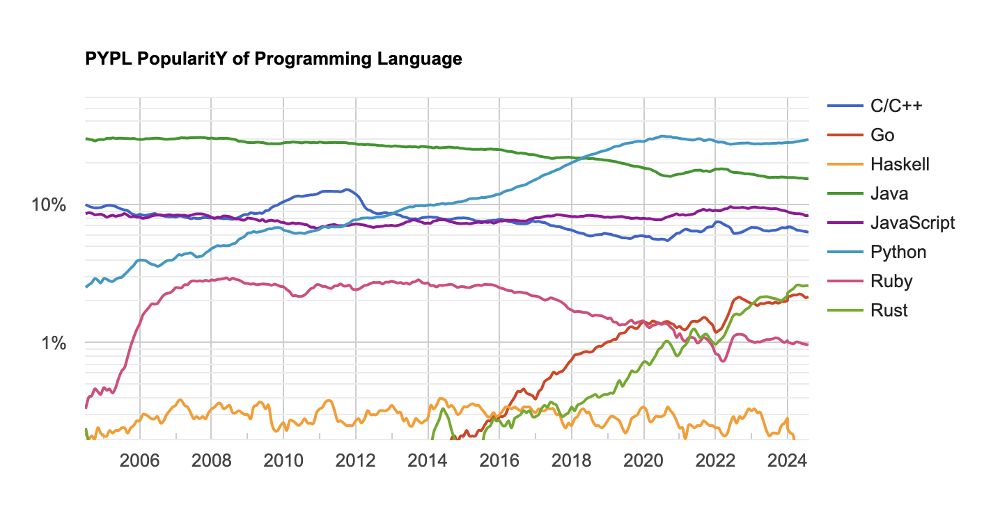

+++
date = '2024-09-24T14:55:44+01:00'
draft = false
title = 'The Hard Truth - Why Distribution Trumps Innovation'
+++

<aside>
💡 Why it's not the best product that wins, but the one that touches the most people
</aside>

## Intro

You might think that the best product wins, right? That’s what most of us would like to believe. After all, if you put in the hard work, pour your soul into crafting the most innovative, efficient, and user-friendly technology, you should reap the rewards. But here’s the kicker: in the real world, the best product doesn’t always win. Instead, it’s the product that touches the most people, grabs the most attention, and gets adopted by the masses that ends up dominating the market. And all of this boils down to one simple truth: distribution is everything.

Let's face it: having the most revolutionary product doesn't guarantee its widespread adoption. Think about it: how many times have you seen a game-changing tech emerge only to fade into obscurity? It's not because it was bad – it's simply because it didn't connect with enough people.

Microsoft Palm Pilot, March 1996

### What This Article Covers

This article goes into the complex technical market dynamics of how well a company distributes its technology, increasing it’s chances of adoption. We'll explore **network effects, distribution, and the minority rule**, using real-world examples to illustrate these concepts. By the end of this article, you should have a deeper understanding of why it's not just about creating the best product that wins, but about touching the most people.

## The Power of Network Effects

When a product or technology gains traction, it creates a snowball effect that draws in more users, enthusiasts, and even investors. This is known as **network effects**, where the value of a product increases exponentially as more people adopt it. Suddenly, you have a critical mass of support from both your community and the main company behind it – giving them more resources to fuel further growth.

This phenomenon creates an irresistible force that makes people feel good about sharing their enthusiasm with others. Imagine being part of a movement where everyone's on board – it's infectious! The flip side, however, is that if passion wanes due to lack of shared interest, the product will struggle to maintain momentum.

### The Minority Rule

<aside>
🧂 How a small group can make a big impact

</aside>

There's another important phenomenon at play here: the minority rule. This concept illustrates how a small group with strong convictions can influence the majority's behavior, even if they represent only a tiny fraction of the population.

Take kosher food, for instance. In the United States, while **less than 0.3% of the population adheres to kosher dietary restrictions**, these individuals are evenly distributed across the country. This means that most food manufacturers opt for kosher certification, as it's easier to produce one type of product rather than two separate ones.

In this scenario, the minority group (those who only eat kosher food) exerts significant influence on the majority, shaping the market in their favor.

Another one relating to cars with manual transmission vs automatic: When some family members cannot drive stick, the majority will opt for an automatic car, making it the default choice.

Find a way for your product to be indispensable for a group of people. Make sure these people absolutely love your product and they can’t live without it.

### Blockchain's Self-Distributing Nature

The blockchain technology has seen incredible growth due to its inherent ability to self-distribute across geographies and cultures. This decentralized nature allows it to tap into the collective potential of a global community, making it more resilient and adaptable in the face of challenges.

## Hence, Distribution is the Key to Unlocking Success

So, what exactly do we mean by distribution? In this context, it's not just about shipping products or services to customers; it's about reaching people's minds, their mindset, and their attention. It's about creating a sense of community and shared experience around your product.

Let's take some examples:

- The world wide web standard vs. other standards at the time: Who would have thought that **HTTP (Hypertext Transfer Protocol)** would become the de facto standard for online communication? Yet, its widespread adoption was largely due to its distribution across the globe, making it accessible to anyone with an internet connection.
- **JavaScript's rise to fame**: Netscape's decision to distribute JavaScript widely helped make it the most popular programming language today. Its adoption wasn't just about being the best; it was about being the most widely used.
- **Cisco vs. competitors**: While Cisco is an industry leader, its success can be attributed to its ability to distribute its technology effectively across various markets and geographies.
- **Python's consistent growth**: This versatile programming language has seen steady increases in popularity over the years, largely due to its ease of use and widespread distribution across various platforms. Now Python is not just super popular, but it has lived enough to see an absolute requirement for AI programming.

Programming languages popularity on a logarithmic scale

## Distribution vs. Adoption: Understanding the Distinction

As we've explored throughout this article, distribution is a critical aspect of a product's success. However, it's essential to distinguish between distribution and adoption, as they're often used interchangeably but have distinct meanings.

### Distribution: Reaching People's Minds and Attention

Distribution refers to the process of making a product or technology available to people, either through direct sales, marketing efforts, or indirect channels like social media, online forums, or community groups. It's about reaching people's minds and attention, creating awareness, and sparking interest in your product.

Think of distribution as the "how" – how do you get your product in front of potential customers? This can involve various strategies, such as:

- Online marketing campaigns
- Social media promotions
- Influencer partnerships
- Trade shows and events
- Partnerships with other companies or organizations

### Adoption: The Actual Use of a Product

Adoption, on the other hand, refers to the actual use of a product by individuals or organizations. It's about people taking action, implementing your technology, or integrating it into their daily lives.

Consider this example:

- Distribution: A company launches a new smartphone with advanced AI capabilities and promotes it through various marketing channels.
- Adoption: A customer purchases that smartphone and starts using its AI features to improve their productivity.

In other words, distribution is the process of getting people aware of your product, while adoption is the actual decision to use it. Distribution can happen without adoption; for instance, a product might be heavily marketed but not gain much traction among customers.

### Key Differences

Let’s break down the difference between distribution and adoption with these distinctions:

- **Exposure vs. Engagement**: Distribution is all about getting your product in front of people, while adoption is about turning that exposure into meaningful engagement—people actually using your technology.
- **Influence vs. Action**: Distribution aims to shape intentions and spark interest, whereas adoption is about real-world action, like people consistently using or relying on your product.
- **Immediate vs. Lasting Impact**: Distribution can create quick bursts of attention or temporary sales, but adoption drives sustained usage and long-term customer loyalty.

### Why Distinguishing Between Distribution and Adoption Matters

Understanding the difference between distribution and adoption is crucial for companies looking to succeed in today's competitive market. By focusing on distribution alone, you might create buzz around your product but fail to translate that into actual sales or usage.

On the other hand, by prioritizing adoption, you can ensure that your customers are engaged with your product over time, leading to loyalty, retention, and ultimately, long-term success.

## Conclusion: It's Not Just About the Product

Distribution is the unsung hero of product success. While having the best product might be a necessary condition for success, it's by no means sufficient. The truth is, most products are not revolutionary game-changers; they're simply good enough to get adopted by the masses.

As we've seen throughout this article, distribution is the key to unlocking adoption. By reaching people's minds and attention, you can create a sense of community and shared experience around your product. Network effects amplify growth, while the minority rule influences majority behavior.

So, what can we take away from this? First, understand that having the best product isn't enough; it's about creating an experience that resonates with people on a deeper level. Second, prioritize distribution over adoption, and you'll be amazed at how quickly your product gains traction.

Thus, there you have it – a deeper understanding of why distribution is everything when it comes to unlocking product success. Remember, it's not just about creating the best product; it's about touching the most people in the right way at the right time. By prioritizing distribution and adoption, you can unlock the secrets to your own success – and that, my friends, is a recipe for triumph.

## Regards

Thanks to Eden Block team members, and a special thanks to [Nelson](https://twitter.com/nelsonthechain), [Sergey](https://twitter.com/sergonchain) who provided feedback during the creation of this article.