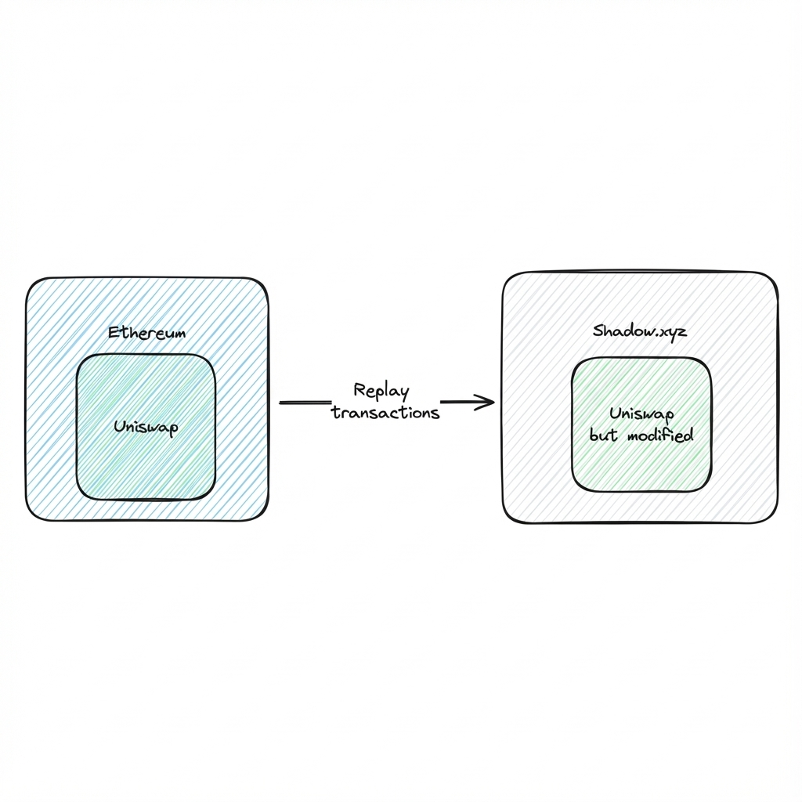
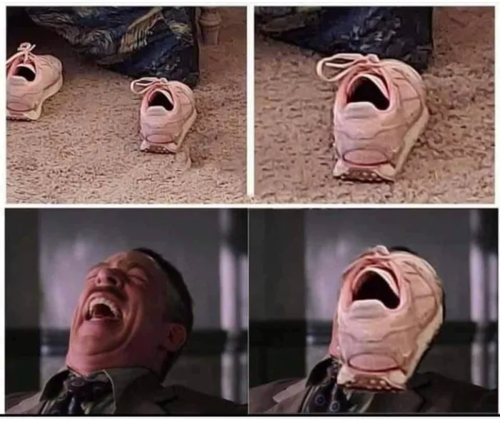
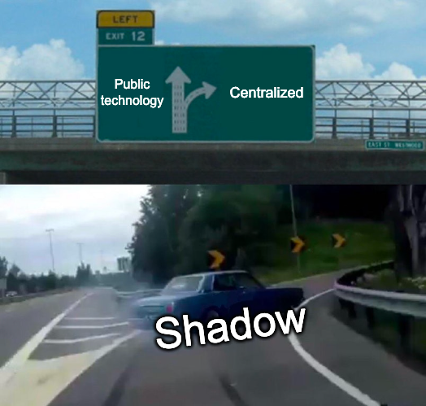
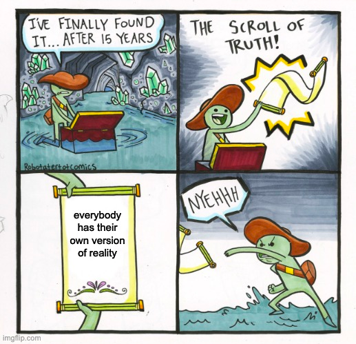
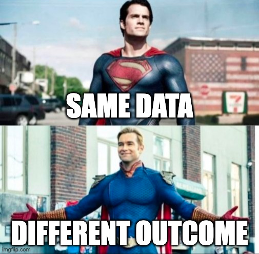
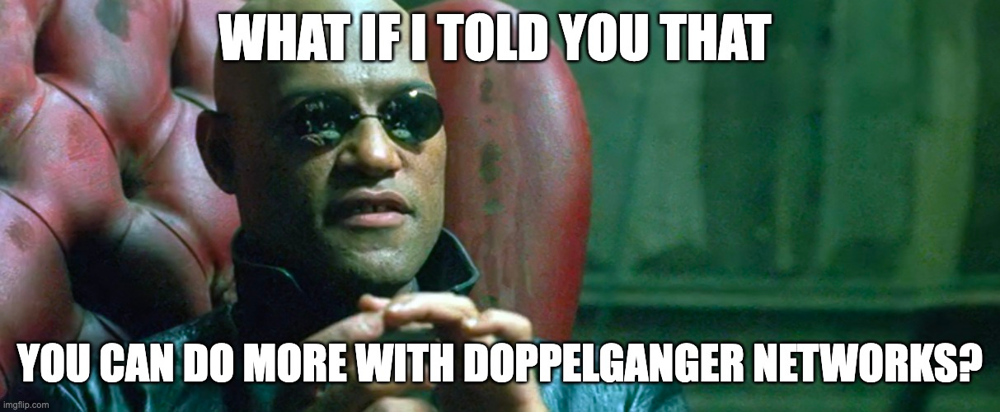
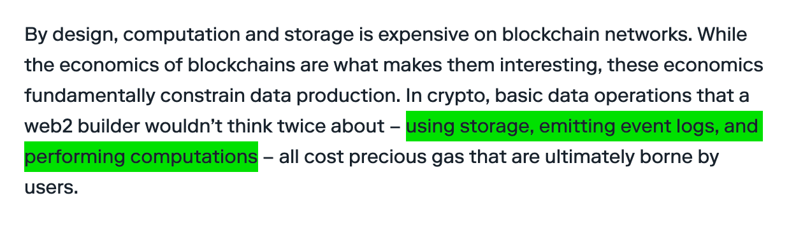

+++
date = '2024-06-13T14:44:47-03:00'
draft = false
title = 'The Inception of Doppelganger Networks'
+++

## Intro

We are starting to see a new approach, a new type of blockchain network, that mimics what an existing network does and is, but they don’t do it exactly as the original one.

This new approach has a few characteristics that define it. It **mirrors an existing chain** but **changes the original rules**. Mirroring the existing chain is done by replaying the transactions just as they are, but changing the original rules makes them incompatible with the original chain. This creates room for new features to flourish but also some interesting problems, which we will explore in this article.

One project stands out as the pioneer of this still-early movement. That project is **Shadow**. Their promise is “free logs,” and maybe you have heard of their successful round recently.



In this article, we explore both the potential and the challenges of a private **Doppelganger Network**. We seek to determine if this truly signals a new era of advanced side-chain computation and storage or a plunge back into centralized structures.

## Standing in the Shadow of Innovation

First, it’s important to understand what Shadow is and how it achieves **free events**.

“Shadow events” are a novel mechanism to generate detailed event data for Ethereum smart contracts, bypassing the cost typically associated with log events. The core of this innovation lies in the concept of Doppelganger Networks, emitted on a parallel chain that “shadows” the Ethereum mainnet.

This effect is achieved by replaying Ethereum transactions on a shadow chain, using an enhanced version of the original smart contract code to allow for more complex calculations and detailed data output.

To accomplish this manually, one needs to take several steps. First, fork the mainnet. Next, change the source code of the smart contract you're watching. Then, include the calculation and extra events you want to produce. Finally, track the new events that are created. Shadow does most of this for you out of the box.

The biggest innovation is the fact that we realized we could mirror a network, with the possibility of extending its features without making any hard fork to the rules of the mirrored system. This is what I call a Doppelganger Network. It’s almost like the original one but slightly different.

Shadowing was something we were always able to do, although we probably didn’t realize we could also change the rules of our local representation. Changing the rules opens up possibilities to not just emit events but also add storage and attach additional computation. And because this is a private fork, we NEED to trust the entity running the fork. This is where the downsides start to show themselves.

## The Dark Side of the Moon

We are conditioned to have a gag reflex when anyone mentions centralized technology, power, or companies; at the same time, we hold decentralized technology to a higher value by default.

However, in this case, running a centralized Doppelganger version of the Ethereum mainnet has considerable downsides. Let’s explore them one by one.

### Multiple Sources of Truth

There was a time when the development of front-end applications was rampant, preceding the era of single-page applications. Developers were experimenting with various frontend frameworks, yet a consensus on the "right" way to build web applications remained elusive. This landscape was transformed with frameworks like React, Angular, and Vue. Among these, Redux emerged as a game-changer, revolutionizing front-end app development by enforcing the concept of a single source of truth. Its main principle was that there needs to be a single top-level source of truth, and each component uses parts of that state without creating a local copy of the reality.

If this sounds alien to you, think about Ethereum or Bitcoin. Ethereum and Bitcoin function not only as currencies but also as bastions of truth. People rely on them to indicate the amount of their digital assets, with every rule programmed to maintain the integrity of that truth.

The introduction of Doppelganger Networks, which compute data and generate exclusive information, complicates this landscape. These forks create isolated truths accessible only to specific entities. When decisions are based on this privately generated data, a divergence emerges. Other parties lacking access to this data are compelled to replicate these computations independently, hoping to mirror the original calculations accurately to reach the same conclusions. The challenge lies in ensuring uniformity in these processes, as any deviation could lead to disparate values and, consequently, divergent decisions and interactions within the system.

This scenario illustrates the dilemma of multiple sources of truth. Such a system is prone to discrepancies and inconsistencies that eventually drive different decisions, distorting the broader system's collective understanding and operation.

We are here to all be part of the same universe, not to create different universes that drive conflict and offer different truths to different entities.

### The Non-Composability Challenge

A critical concern with creating a private fork is the resultant non-composability of data. In open data ecosystems, composability is fundamental; it enables the union and versatile utilization of data from diverse sources, fueling innovation and discovery. However, private forks introduce a barrier to this dynamic.

When data remains confined within a private environment, its integration with other datasets becomes impractical. This confinement not only limits its utility but also impedes collaborative efforts and knowledge sharing. Such private forks, albeit unintentionally, foster the formation of data silos. These silos act as obstacles, reducing the collective growth and evolution of the broader data community.

Furthermore, this approach risks fragmenting the blockchain ecosystem. Networks operating in isolation hinder seamless interaction, which is essential for fostering a vibrant, interconnected, and innovative blockchain landscape. This lack of interoperability can significantly stifle the potential for broader collaboration and cooperation.

Also, I don’t envision having bridges between private forks and public chains.

### Manipulation Risk

The centralized nature of a private fork, especially when managed by an external entity, introduces the risk of data manipulation. The entity in control could alter or selectively disclose information, thereby potentially jeopardizing the integrity of applications reliant on this data.

One could argue that we already depend a lot on centralized systems that could alter the data we digest. While it's true that most of these systems operate without malicious intent, it's crucial to revisit the foundational ethos of the blockchain revolution.

The drive towards blockchain technology was fueled by a desire to establish systems that are inherently transparent, decentralized, and immune to the risks of unilateral data manipulation – principles that are fundamentally challenged by the centralization inherent in private forks.

### The Risks of Single Entity Dependency

The robustness of Shadow’s product is profoundly anchored in the controlling entity's operational stability, management practices, and ethical standards. Imagine a scenario where this entity, rather than deliberately concealing data, claims system malfunctions with a casual "our systems are down, apologies." From an external perspective, discerning the truthfulness of such assertions is challenging. Ultimately, the underlying reason becomes secondary to the critical issue: your application is cut off from the essential data required.

## Deciphering Shadow's  
Seed

Shadow's recent seed raise, led by Paradigm, serves as a trojan horse toward Doppelganger Networks that can solve issues related to data availability, limited execution, and indexing. This funding round is not merely a financial milestone but potentially signals a shift in market dynamics.

### Analyzing the Market Signal

The capital influx, especially in the context of current market conditions, could be interpreted in two ways: it's either a significant vote of confidence, indicating that Shadow's valuation and potential are high, or it's a harbinger of an imminent bullish trend in the broader market. Venture capital from a firm as reputable as Paradigm tends to be strategic, suggesting a strong team, positive market signals, and substantial potential for the product.

### Strategic Partnerships

The composition of investors in this round extends beyond mere financial backing. Entities like Coinbase Ventures, Electric Capital, the Ethereum Foundation, Uniswap, and Flashbots bring to the table a mix of industry expertise, networking opportunities and potential integrations. Their involvement underscores Shadow's strategic and technological aspirations beyond the capital investment.

Let’s not forget that Uniswap, Flashbots and Coinbase are logos on Paradigm’s website. That’s VC talk for “Paradigm invested in these companies”. This shows that Paradigm has significant trust in Shadow and sees potential synergies with the aforementioned companies.

## The Value Proposition of Shadow’s Technology

Shadow’s commitment to solving the complexities of on-chain analytics is evident. The aim to make event logs cost-free is ambitious, potentially unlocking new paradigms in how smart contracts are developed and maintained. The fact that you can deploy a contract without events and use Shadow to add the necessary events afterwards, is a game-changer. One of Ethereum's big features is that the code is immutable; now, with products such as Shadow, even if you forget to add some events or realize you’re computing them incorrectly, you can replace the code (in the private fork) and fix the issue.

However, events alone may only take a company's value so far. I am curious if Shadow's initial offering of free event logs will eventually lead to adding computation or storage. That prospect is truly exciting for me because it shows that more can be done with this approach. It also tickles my ego since I can say, “Called it.”

Shadow’s current narrative presents event logs that can be made “free” with their technology, but in the article published when they became Entrepreneurs In Residence with Paradigm (dated Jun 22, 2023), they were discussing not just events but also computation and storage.

## Conclusion

In conclusion, Shadow’s funding round represents more than a mere financial milestone; it is an investment in the future of blockchain infrastructure. It is a vote of confidence in the team and their capabilities, but more importantly, it paves the way for the emergence of Doppelganger Networks that can mirror a public network yet diverge by changing their internal rules. This allows for increased computation, expanded storage, and data flexibility, as well as rule modifications without undergoing the EIP approval process, community acceptance or hardware limitations.

Looking forward, Doppelganger Networks could revolutionize how we approach blockchain development, offering a sandbox for creativity and rapid iteration that could lead to significant innovations. However, it is difficult to envision a future that finds a way to decentralize this technology, possibly creating clusters of innovation that don’t function in the decentralized ecosystem. The bigger the innovation, the furthest the Doppelganger Network strays from the accepted rules of public networks, making it more difficult to integrate and function within the ecosystem.

## Resources

- [https://www.shadow.xyz/](https://www.shadow.xyz/)
- [https://jobs.ashbyhq.com/shadow](https://jobs.ashbyhq.com/shadow)
- [https://ethereum-magicians.org/t/erc-7571-shadow-events/17134/1](https://ethereum-magicians.org/t/erc-7571-shadow-events/17134/1)
- [https://github.com/shadow-hq/ERCs/blob/erc-7571-shadow-events/ERCS/erc-7571.md](https://github.com/shadow-hq/ERCs/blob/erc-7571-shadow-events/ERCS/erc-7571.md)
- [https://dailybruin.com/2012/10/11/ucla-students-create-scene-shot-an-app-with-live-photo-streams-of-local-hot-spots](https://dailybruin.com/2012/10/11/ucla-students-create-scene-shot-an-app-with-live-photo-streams-of-local-hot-spots)
- [https://www.linkedin.com/in/alvinhsia/](https://www.linkedin.com/in/alvinhsia/) - airbnb ~6y
- [https://www.linkedin.com/in/hsiaemily/](https://www.linkedin.com/in/hsiaemily/) - airbnb ~5y
- [https://twitter.com/ptrwtts/status/1672354941560848385](https://twitter.com/ptrwtts/status/1672354941560848385) - incubation 26 Jun
- [https://twitter.com/alvinhsia/status/1733895274962014618](https://twitter.com/alvinhsia/status/1733895274962014618) - pre-population of data