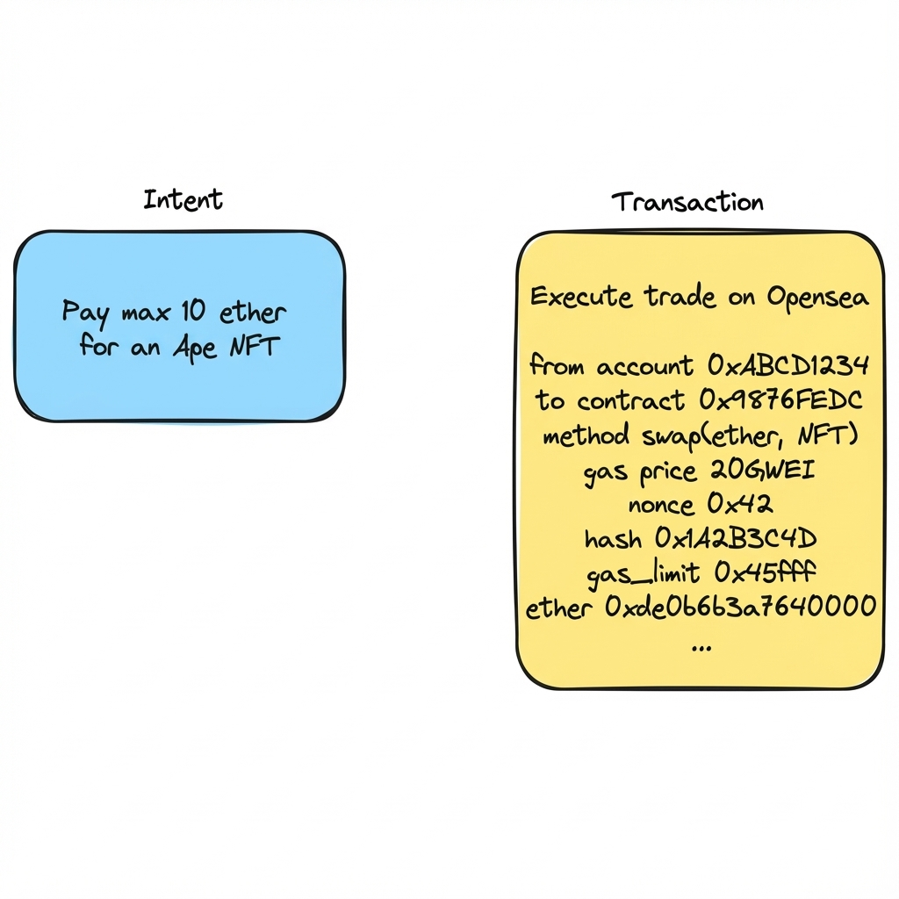
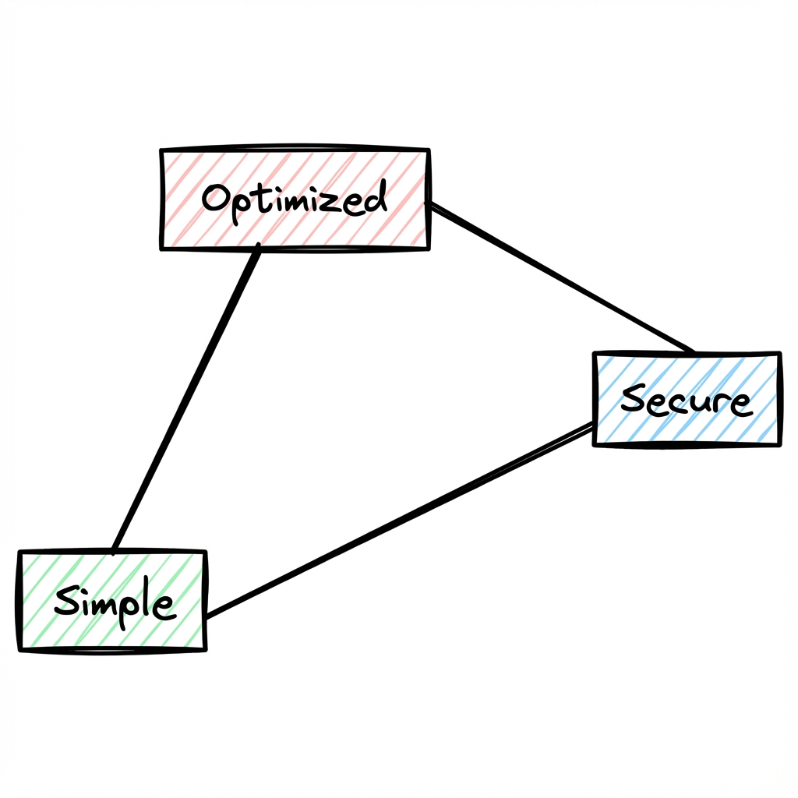

+++
date = '2023-12-07T14:37:14-03:00'
draft = false
title = 'The Next Blockchain Bull Run: User Intents Paving the Way for Mass Adoption'
readingTime = true
+++

## Introduction

In the blockchain ecosystem, there's an ongoing quest for a foundational shift that will pave the way for the next wave of user adoption. This involves a deep reevaluation and reinvention of how on-chain transactions are executed, centralizing around the innovative concept of **Intents**.

Humans desire outcomes, while the “how” is a side effect that must be solved to fulfill their wishes. It is more natural to think about the desired side effect instead of defining all the necessary steps to get there. Intents specify the desired outcome without detailing the exact execution path.

We currently have “transactions” that are extremely specific and rigid about their parameters and imply an exact execution path that includes the originating account, smart contracts, gas amount and prices, chain IDs, nonce and other details that most users don’t really have to fiddle with.

The promise of Intents comes to abstract away all of the superfluous details that users usually don’t care about to get the simple outcome of “I want 100 A-TOKENS, and I am willing to pay at most 50 B-TOKENS”.



Intents become even more promising if you could abstract away the different chains and L2s we currently have. If I want a specific NFT, I should not care where the NFT is hosted. If I want to be exposed to a specific asset, it doesn’t really matter where the asset (or its representation) exists as long as the trust assumptions and set conditions are met.

## The Promise of Intents

There is a recent industry understanding that something is missing for mass adoption to happen. Intents-based solutions are expected to dominate in providing that part (alongside Account Abstraction).

**These three principles are crucial to achieve mass adoption:**

### Simplicity

By providing a simpler, more natural way for users to express their goals, we eliminate knowledge barriers and save them from getting stuck in execution details.

Intents simplify the interaction between users and complex systems by abstracting the intricate details of how objectives are achieved. This simplicity is centered around the user's ability to express what they want without understanding the underlying technical processes. For instance, users can state their intent to obtain an NFT and are willing to part with a collection of tokens and NFTs, and the system takes care of the technicalities.

### Optimization

Following the theme of simplicity, the optimization principle in an Intent system takes this user-centric approach a step further by ensuring the most efficient use of a user’s assets. In the context of trading NFT’s or tokens, the system not only understands the user’s goal, but also actively works towards achieving it with the minimum necessary expenditure of assets.

When the user expresses their intent to acquire an NFT, the system doesn’t just execute the trade; it optimizes the transaction to use the least amount of the user’s assets while still fulfilling the desired outcome. This optimization is crucial as it adds significant value to the user’s experience and assets.

> The occasions on which MEV negatively impacts user execution generally arise due to high degrees of freedom that transactions give up to their executors (e.g. slippage limits). It is thus no great leap in logic to assert that intent-based applications which surrender greater degrees of freedom should design their systems for execution with greater caution.  
> — [Paradigm article](https://www.paradigm.xyz/2023/06/intents)

An intent-based solution has the potential to make things easier by reducing fees while providing better prices or quite the opposite. By integrating this optimization principle, the intent system becomes more than just a facilitator of transactions; it becomes a steward of the user's assets, safeguarding their interests and maximizing their value.

### Security

As for now, even with the adoption of [EIP-712](https://eips.ethereum.org/EIPS/eip-712), the average user won’t understand what they are signing. Not being able to validate their intent makes them vulnerable to various types of attacks, scams, or innocent mistakes.

In an Intent system, security is an essential principle that plays a crucial role in maintaining the trust of users and the integrity of the system. The security measures in place are designed to ensure that every transaction and interaction is conducted safely and securely, protecting against potential vulnerabilities and threats. By prioritizing security, users can have the peace of mind that their data and interactions are protected at all times.



> The Intent “Trillemma” where you can have your cake and eat it too

## Sequence vs Outcome

Transactions form the backbone of Ethereum. Without a transaction being signed and broadcasted, no action takes place. No change is made in the state, no contract is updated, no tokens are transferred, and no NFTs are minted. Transactions are a crucial aspect of Ethereum, but it's time to start thinking about them and their complexities a lot less.

Intents describe the desired system state but lack the specificity of transactions. They must still be credible and act as a commitment.

- **Transactions:** define the execution path.
- **Intents:** define the outcome of the execution.

In programming, these are very similar to two fundamental programming archetypes: **Imperative** and **Declarative** programming. Each style comes with its own advantages and disadvantages.

Some developers might not realize, but they’ve already used declarative programming languages if they ever wrote an SQL statement. For reference, SQL is commonly used language to query database systems.

```sql
SELECT * FROM users WHERE age >= 18
```
It does not specify what algorithm to use to filter or sort for these users. The database has internal algorithms that could change at any time, but the outcome must always be users 18 years or older.

Since the two approaches already exist in Computer Science and have been explored, we can bring some learnings into our realm.

|               | Declarative                                                       | Imperative                             |
|---------------|-------------------------------------------------------------------|----------------------------------------|
| **Primary focus**        | What the program should accomplish (End goal)                   | How the program achieves it (Process/Steps) |
| **Control over Process** | High-level control; abstracts the underlying processes         | Detailed control over the computing process  |
| **Code Characteristics** | Less code; focuses on expressions                             | More code; relies on statements, loops, conditionals |
| **Readability**          | Generally more readable due to simplicity and abstraction      | Can be less readable, especially in complex implementations |
| **Language examples**    | SQL (database queries), HTML (web structure), Haskell (functional) | C, Java, Python (procedural or object-oriented) |
| **Advantages**           | - Easier to understand and maintain<br>- Often requires less code | - More control over performance<br>- Familiar to many programmers |
| **Disadvantages**        | - Less control over performance<br>- Can be less intuitive     | - Can lead to more complex and verbose code<br>- Harder to maintain in large systems |
| **Best Use Cases**       | Situations where the goal is clear but the path is complex    | Scenarios requiring fine-grained control over operations |
| **Performance**          | Efficient for certain tasks, but less control over optimization | Can be optimized for performance at a low level |

## Current Intent Landscape in Blockchain and Technology

The concept of intents, particularly in the blockchain and broader technology sectors, is evolving rapidly, manifesting in various forms and applications. We can observe two predominant types of intent-based solutions that are shaping the landscape: **solver-based and AI-based approaches**.

### Solver-Based Intents

Solver-based Intents is currently a widely adopted concept in blockchain industry. This approach revolves around a matcher, an order book, or any other suitable platform, to effectively gather user intents and subsequently delegate the problem-solving challenge to a list of solvers. These solvers, armed with their expertise and capabilities, compete on providing the most optimal solution for the given task.

Traditionally, solvers have engaged in a competitive environment, where they vie against each other to offer the best possible solution and a format of "the winner takes it all". However, recently, partial or joint solutions were offered. In such scenarios, multiple solvers collaborate and combine their respective expertise to generate a comprehensive solution that surpasses what a single solver could achieve alone.

One of the characteristics of solver-based solutions is their reliance on structured inputs. Additionally, products follow this approach tend to be more decentralized in nature, allowing for a diverse range of solvers to participate and contribute their unique perspectives and strategies.

The most prominent example of solver-based solutions is **CoWSwap**.

### AI-Based Intents

The concept of an AI engine trained to solve intents directly is innovative. This engine has a unique edge in that it can use free text as input, and it mostly utilizes this option. While the benefits of this approach are clear, there are also some issues that need to be addressed.

- **Centralized Nature:** Efficiently solving decentralization challenges in AI models is yet to come. Future solutions may use decentralized models and computing power to generate outputs.
- **Training sources:** It is generally difficult to find databases to train models, and frequent changes make it even harder to manage.
- **User validation step:** When providing instructions to an engine, the risk of inaccuracy or lack of clarity on the user's part can lead to results that do not align with their intended outcome. This potential risk is acceptable when using Siri to play a song or make a call, but not when automating financial transactions.

The outcome is that any output must be validated by the user. Regarding the principals above (security, simplicity,…), such output validation by the user is unacceptable. In other words, asking the user to sign the output will drop the simplicity and security impact.

Also, users can abuse the system and execute it independently and avoid paying fees. The alternative: structured intents, based on well-defined needs but as minimal as possible.

A good compromise may be to use an NLP one step before to translate the free text into structured input.

## Risks

### Intents Mempool

The dilemma between private and public mempools is similar to the transactions mempool, although the solving process has its own angle. On one hand, there is an additional risk of being abused by a greedy solver. On the other hand, since there is no explicit execution in the mempool, it is harder to extract MEV.

### Competition Risk

Simply having multiple solvers is not sufficient to be considered healthy competition. Solver-based products should ensure competition on every intent, although achieving this is not an easy task. If different solvers handle different challenges, it cannot be considered true competition. If solvers do not sense any challenge and are only used for certain cases, they may become less competitive and provide suboptimal solutions for the user.

### Profitability Risk

Currently, it is unclear how profitable the solvers business will ultimately be. The compensation for each role in this process may not be attractive enough. Additionally, hyper-competition could result in an insufficiently profitable market.

## Architecture of an Intent System

Below is a proposed breakdown of the different actors involved in the system. Each actor has a specific purpose and responsibility, although some could be combined into a single entity. It is crucial to provide a separate and detailed description of each actor and their responsibilities. It is possible to create various valid system architectures by utilizing a combination of these actors, whether they operate independently or are merged into a single entity with multiple responsibilities.

### User

The user is the primary actor who interacts with the intent system. They input their needs, desires, or objectives into the system, expecting it to respond or act according to their specified intents.

### Solver

The Solver processes the user’s inputs and works out a solution or response. This typically involves finding the optimal path to meet the criteria set by the user, often involving interaction with smart contracts.

### Relayer

Once the Solver has created an execution path, the Relayer implements this path. This role involves carrying out the actual actions or operations required to fulfill the User’s Intent.

### Observer

The observer monitors the execution process to ensure the Intent is solved within the defined constraints. This role involves overseeing the system’s operations and checking that everything proceeds according to the User’s specifications.

### Verifier

The Verifier comes into play after the Observer has gathered information about the execution. Using these observations, the Verifier can finalize the agreement between the User and the other actors, ensuring that the Intent has been fulfilled satisfactorily and according to the agreed-upon constraints.

If an associated bounty is attached to the correct fulfillment of an Intent, the Verifier can split the bounty among the participating actors.

**Process Summary:**  
- The User sets the stage with their constraints.  
- The Solver translates these constraints into an actionable path.  
- The Relayer implements this path.  
- The Observer ensures that the execution happened and adheres to the User's constraints.  
- The Verifier finalizes the process, confirming that the Intent has been satisfied.

## Conclusion

The exploration into the realm of Intents within the blockchain ecosystem heralds a transformative shift in how users interact with and leverage blockchain technologies. The promise of Intents, underscored by principles of simplicity, optimization, and security, aligns with the broader objective of propelling blockchain towards mass adoption. Intent-based systems are breaking down barriers that have previously hindered widespread engagement with this revolutionary technology by abstracting the complexities inherent in blockchain transactions and focusing on the outcomes users desire.

While all of this sounds optimistic, we acknowledge other existing challenges.

As we delve into the possibilities presented by Intent-based systems in the blockchain space, we acknowledge a landscape teeming with potential yet punctuated by significant, unresolved challenges. These challenges, far from detracting, underscore the vastness and dynamism of the intent space, highlighting areas ripe for innovation and further exploration. Concerns such as managing transaction gas and other associated costs remain at the forefront, presenting economic and practical considerations that need addressing to enhance system efficiency and user experience.

The optimization of Intent execution brings its own set of complexities, especially the risk associated with solvers potentially creating suboptimal execution paths. This issue underscores the need for sophisticated algorithms and oversight mechanisms to ensure that users' assets are utilized to their maximum value. Additionally, the concept of a "coincidence of wants" introduces an intriguing dimension to the Intent ecosystem. This phenomenon, where multiple Intents align, offers opportunities for zero-slippage trades between peer-to-peer parties, optimizing asset usage and enhancing the system's economic efficiency.

However, the emergence of multiple platforms implementing Intents could fragment this burgeoning ecosystem, limiting the potential for solving opposing intents through zero-slippage mechanisms. Such fragmentation not only splits the user base but also isolates critical actors like solvers, confining them to specific markets and thereby diminishing the system's overall effectiveness and reach or forcing them to add complexity to integrate with multiple platforms. Developing uniform standards and interoperable frameworks is essential to mitigate this risk and foster a cohesive, inclusive Intent ecosystem.

The question of incentives also looms large in this space. While incentivization can drive initial adoption and usage, there's a palpable risk that user engagement might wane once these incentives are withdrawn. Therefore, a robust, forward-looking strategy that transcends mere short-term incentivization is imperative. Such a strategy must build inherent value and utility within the intent system, ensuring sustained user engagement and system viability. To optimize for the Intent, incentives could be provided proportional to the execution's optimality.

**In summary**, the Intent-based approach in blockchain signifies the advent of a new era of user-centric, efficient, and secure interactions. However, this is still a field in its early stages, with many unexplored areas and unresolved issues. The way forward involves thoughtfully navigating these challenges, leveraging the collective expertise of the blockchain community, and continuously innovating to realize the full potential of Intents. The journey ahead is complex but promising, with the potential to redefine the blockchain landscape and catalyze its evolution into a more accessible and impactful technology.

## Resources

- [https://www.paradigm.xyz/2023/06/intents](https://www.paradigm.xyz/2023/06/intents)
- [https://hackernoon.com/why-intent-centric-is-blockchains-next-big-thing](https://hackernoon.com/why-intent-centric-is-blockchains-next-big-thing)
- [https://flagship.fyi/outposts/market-insights/navigating-intents-unveiling-a-user-centric-pathway-in-blockchain-transactions/](https://flagship.fyi/outposts/market-insights/navigating-intents-unveiling-a-user-centric-pathway-in-blockchain-transactions/)
- [https://medium.com/alliancedao/intents-are-just-7deaeb4336be](https://medium.com/alliancedao/intents-are-just-7deaeb4336be)
- [https://eips.ethereum.org/EIPS/eip-7521](https://eips.ethereum.org/EIPS/eip-7521)
- [https://www.eip4844.com/](https://www.eip4844.com/)
- [https://eips.ethereum.org/EIPS/eip-4844](https://eips.ethereum.org/EIPS/eip-4844)
- [https://ethereum-magicians.org/t/eip-4844-shard-blob-transactions/8430](https://ethereum-magicians.org/t/eip-4844-shard-blob-transactions/8430)
- [https://members.delphidigital.io/reports/wtf-is-anoma-part-1-wtf-are-intents](https://members.delphidigital.io/reports/wtf-is-anoma-part-1-wtf-are-intents)
- [https://members.delphidigital.io/reports/wtf-is-anoma-part-2-wtf-are-intent-based-apps](https://members.delphidigital.io/reports/wtf-is-anoma-part-2-wtf-are-intent-based-apps)
- [https://members.delphidigital.io/reports/wtf-is-anoma-part-3-wtf-is-typhon](https://members.delphidigital.io/reports/wtf-is-anoma-part-3-wtf-is-typhon)
- [https://www.youtube.com/watch?v=Cs7TJjZ-RMQ](https://www.youtube.com/watch?v=Cs7TJjZ-RMQ)
- [https://www.youtube.com/watch?v=ALBc3ck7p2Y](https://www.youtube.com/watch?v=ALBc3ck7p2Y)
- [https://youtu.be/4Nh4EOpvKMY](https://youtu.be/4Nh4EOpvKMY)
- [https://youtu.be/7g5GNq_jXR8](https://youtu.be/7g5GNq_jXR8)