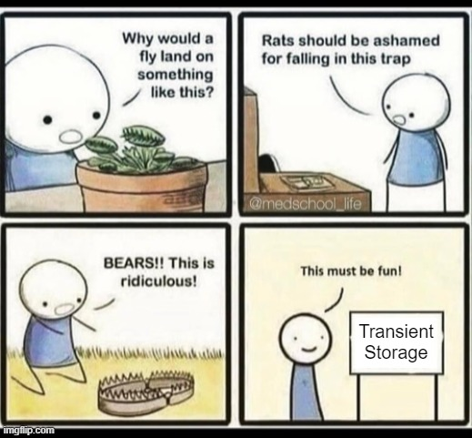

+++
date = '2024-02-29T14:23:45+01:00'
draft = false
title = 'The Right Way to Use Transient Storage (Eip 1153)'
readingTime = true
+++

A new chapter is being written with the introduction of Transient Storage, courtesy of [EIP-1153](https://eips.ethereum.org/EIPS/eip-1153). This upgrade promises to revolutionize the temporary storage and management of data within transactions, stirring quite a debate in the community. It aims to optimize gas costs and enhance the efficiency of smart contracts. Yet, for all its potential, it's easy to misuse, leading to costly mistakes.



## Who This Article Is For

If you're a developer familiar with Solidity and keen on Ethereum's latest, this article is for you. Whether you're looking to optimize smart contracts or explore new features, we'll dive into how Transient Storage opens up new possibilities.

EIP-1153 was first proposed in June 2018, and since then, it has evolved and changed how gas pricing and refunding work and how the opcodes are designed. That’s why some articles you’ll find online are obsolete or don’t explain correctly how this works and how it should be used.



Since this is such a controversial topic, an easy-to-get-it-wrong implementation detail, we will explore some ways you can mess this up. By the end of this article, when you review code or build software yourself, you will identify when you fall into one of these traps and should be able to correct them.

This feature has its pros and cons. On one hand, it can help you reduce gas costs if used correctly. On the other hand, it can also add complexity, introduce new context, and create additional EVM mechanics, which can increase the attack surface and make the auditing process more complicated.

Even the Solidity team [is warning about possible misuse](https://soliditylang.org/blog/2024/01/26/transient-storage/) of this feature.


Without further ado, let’s dive into the technical details.

## How Transient Storage Works

Think of Transient Storage as a [hash table](https://en.wikipedia.org/wiki/Hash_table), one that starts fresh for each contract with each new transaction. Transient Storage offers a temporary space for data that only vanishes after the transaction completes.

### Storage, Memory, Stack and now Transient Storage

The most important thing to understand is that Transient Storage is a new Page you can write and read from. The Transient Storage Page does not intersect with the Storage Page.

Let's examine all the ways information can be stored in the EVM: Stack, Memory, Storage, and now, Transient Storage.


It’s a new place where things are written to.

I intentionally omit the possibility of storing information as contract bytecode or calldata, as these methods have downsides.

EIP-1153 describes Transient Storage as follows:

> This proposal introduces transient storage opcodes, which manipulate state that behaves identically to storage, except that transient storage is discarded after every transaction. In other words, the values of transient storage are never deserialized from storage or serialized to storage.
> 

Thus, we should not consider it identical to Storage but a novel approach that adds a new state Page with unique properties. To be clear, Transient Storage does not write or read from the Storage Page.

### The Lifetime of Transient Storage

The most significant characteristic of Transient Storage is its lifetime, which exists only for the duration of a Transaction. This is unique, considering that none of the other Pages live through the complete execution of a Transaction.

| Feature | Lifetime | Scope |
| --- | --- | --- |
| **Storage** | Persists beyond transaction execution. | Contract-bound |
| **Memory** | Exists only within a call. | Call-specific |
| **Stack** | Exists only within a call. | Call-specific |
| **Transient Storage** | Exists for the duration of the transaction. | Contract-bound |

You can call a contract multiple times within the same Transaction, and it will retain the values set in the Transient Storage Page. In this example, you can set a value in the Transient Storage Page with the function `setNumber(uint)` and retrieve that same transient storage slot value with `getNumber()`.

And you can see that this value is retained in **Transaction #1** across multiple calls.


But the value no longer exists in **Transaction #2** because the whole page is cleared at the end of each Transaction.

### New Opcodes

Two new opcodes facilitate interaction with Transient Storage:

**TSTORE**

```solidity
assembly {
    // set `value` in `location` 
    tstore(location, value)
}
```

**TLOAD**

```solidity
assembly {
    // get value from `location`
    var := tload(location)
}
```

At the moment, Solidity offers access to this feature only through Yul (assembly), but you can create a library or a contract for easier access to Transient Storage.

```solidity
// This support was introduced with Solidity 0.8.24
pragma solidity 0.8.24;

contract TransientStoragePage {
    function tstore(uint location, uint value) public {
        assembly {
            tstore(location, value)
        }
    }

    function tload(uint location) public returns (uint value) {
        assembly {
            value := tload(location)
        }
    }
}
```

### Transient Storage in View Functions (STATICCALL)

Writing to Transient Storage is not permitted in view functions.

Since a state exists after the function’s execution and before the transaction concludes, this can’t be considered a `view` or `pure` method.

### **Automatic Clearance at Transaction's End**

Transient Storage is automatically cleared at the end of the transaction, not at the call's conclusion.

Even if the contract’s method is marked as `public` or `external`, this doesn't mean the Transient Storage Page is cleared at the end of the execution. Multiple `public` or `external` calls can happen in the same Transaction.

Only when the Transaction is finalized is the whole Page cleared.

## What Transient Storage Solves

We first need to explore what Transient Storage is useful for, what it promises and how it can make our life easier as developers.

### Reduced Costs

The most similar Page to Transient Storage is the Storage Page. Thus, if you want to have very similar functionality, you’d need to save data to the Storage Page.

However, writing to the Storage Page is much more expensive. This is how much it costs when you write to a key:

- 20,000 gas - when you change from zero to anything else
- 2,900 gas - when you update a non-zero value
- 100 gas - when the key is warm (you’ve *recently* written to this key)

In contrast, writing to the Transient Storage Page always costs 100 gas, simplifying gas cost calculations and making operations cheaper.

### Gas Refunds

Related to gas costs, Storage writes are associated with a gas refund mechanic, which has grown complex over time due to Denial of Service (DoS) attack prevention measures.

In essence, developers might write to and clear a specific Storage slot, receiving a gas refund. However, this refund is capped at 20% of the total transaction gas cost, potentially limiting the refund to less expensive transactions. Also, refunds are not issued if the transaction reverts.

Transient Storage addresses this issue by keeping costs low and eliminating the need for refunds. It doesn't qualify for gas refunds because, unlike traditional storage that may clear existing disk states for a refund, Transient Storage begins anew with each transaction, leaving no state on the disk afterwards.

## Practical Examples

This section explores the innovations and challenges that Transient Storage brings to the Ethereum ecosystem. By understanding these, developers can leverage Transient Storage's full potential while navigating its pitfalls.

### Cheap Reentrancy

We can create a contract that implements a cheaper reentrancy guard, one that doesn’t use a Storage slot, but uses a Transient Storage slot. This should be cheaper because working with a “cold” Storage slot costs 20,000 gas (or 2,900 gas if the value is not zero), while working with a Transient Storage slot costs only 100 gas.

```solidity
// SPDX-License-Identifier: MIT
pragma solidity ^0.8.24;

contract Reentrancy {
    // A constant key for the reentrancy guard stored in Transient Storage.
    // This acts as a unique identifier for the reentrancy lock.
    bytes32 constant REENTRANCY_GUARD = keccak256("REENTRANCY_GUARD");

    // Modifier to prevent reentrant calls.
    // It checks if the reentrancy guard is set (indicating an ongoing execution)
    // and sets the guard before proceeding with the function execution.
    // After the function executes, it resets the guard to allow future calls.
    modifier nonReentrant() {
        // Ensure the guard is not set (i.e., no ongoing execution).
        require(tload(REENTRANCY_GUARD) == 0, "Reentrant call detected.");

        // Set the guard to block reentrant calls.
        tstore(REENTRANCY_GUARD, 1);

        _; // Execute the function body.

        // Reset the guard after execution to allow future calls.
        tstore(REENTRANCY_GUARD, 0);
    }

    // Uses inline assembly to access the Transient Storage's tstore operation.
    function tstore(bytes32 location, uint value) private {
        assembly {
            tstore(location, value)
        }
    }

    // Uses inline assembly to access the Transient Storage's tload operation.
    // Returns the value stored at the given location.
    function tload(bytes32 location) private returns (uint value) {
        assembly {
            value := tload(location)
        }
    }

}
```

This example greatly reduces the amount of used gas to implement a re-entrancy guard because it doesn’t use a Storage slot and it doesn’t rely on the gas refund mechanic to reduce costs.

### Cheap Hash Table

Transient Storage introduces an efficient way to implement hash tables for temporary data handling. Developers can now create and use hash tables with unique values at a fraction of the cost of traditional storage methods. This efficiency opens up new possibilities for data management within smart contracts, enabling complex operations that were previously too gas-expensive.

Let’s assume you want to extract only the unique values from an array of numbers. One can do this only by using a Transient Storage map.

```solidity
// SPDX-License-Identifier: MIT
pragma solidity ^0.8.24;

contract UniqueValues {
    // Function to return unique values from an array of unsigned integers.
    // It takes an array as input and returns a new array with duplicate values removed.
    function extractUnique(uint[] calldata input) public returns (uint[] memory) {
        uint uniqueCount = 0; // Counter to keep track of the number of unique values found.

        // Initialize a new dynamic array in memory to store unique values.
        // Its initial size is the same as the input array, assuming all values could be unique.
        uint[] memory uniqueValues = new uint[](input.length);

        // Iterate over each value in the input array.
        for (uint i = 0; i < input.length; i++) {
            uint currentValue = input[i]; // Current value being checked.

            // Use the tload function to check if currentValue has already been marked as seen in Transient Storage.
            // If tload returns 0, it means this value has not been encountered before.
            if (tload(currentValue) == 0) {
                // Add the currentValue to the uniqueValues array and increment the uniqueCount.
                uniqueValues[uniqueCount++] = currentValue;
                
                // Mark this currentValue as seen by storing a 1 in its corresponding location in Transient Storage.
                tstore(currentValue, 1);
            }
        }

        // Resize the uniqueValues array to match the actual number of unique values found.
        // This is necessary because Solidity does not support dynamic memory array resizing.
        // The "memory-safe" flag ensures that the assembly code adheres to memory safety.
        assembly ("memory-safe") {
            mstore(uniqueValues, uniqueCount)
        }

        // Return the resized array containing only the unique values.
        return uniqueValues;
    }

    // Uses inline assembly to access the Transient Storage's tstore operation.
    function tstore(uint location, uint value) private {
        assembly {
            tstore(location, value)
        }
    }

    // Uses inline assembly to access the Transient Storage's tload operation.
    // Returns the value stored at the given location.
    function tload(uint location) private returns (uint value) {
        assembly {
            value := tload(location)
        }
    }
}
```

The caveat in this example is that if, in the same Transaction, we call `UniqueValues.extractUnique` multiple times, we likely won't get a correct response for all calls but the first one. This is because we don't clear out the hash table at the end of each call.

To fix this issue, we’d need to use more gas by clearing out Transient Storage slots one by one. A developer would likely not want to do because of two main reasons:

- the Transient Storage Page gets cleared automatically anyway (however, at the end of the Transaction, not after each call);
- clearing it uses more gas.

This would be one of the caveats why using Transient Storage, or relying on its automatic clearing might create problems.

Let’s add the code that would clear the Transient Storage slots before we return the unique values.

```solidity
// Clear out any Transient Storage slots used
for (uint i = 0; i < uniqueValues.length; i++) {
    tstore(uniqueValues[i], 0);
}

// Return the resized array containing only the unique values.
...
```

While this showcases the efficiency of Transient Storage for deduplication tasks, this example also highlights the need for manual cleanup of used Transient Storage slots.

This is where people might make mistakes.

### Context Setting

Another way to use Transient Storage is to set a context for an external contract where you don’t have to make any assumption about how that contract behaves.

The idea is that you set some context, you give control to the external contract and at the end of the execution, you delete the context.

```solidity
// SPDX-License-Identifier: UNLICENSED
pragma solidity ^0.8.24;

contract Context {
    // Slots for transient storage
    bytes32 private constant NUMBER_SLOT = keccak256("number");
    bytes32 private constant ADDRESS_SLOT = keccak256("address");

    // Sets a number in the transient storage
    function getNumber() public returns (uint) {
        return uint(tload(NUMBER_SLOT));
    }

    // Sets an address in the transient storage
    function getAddress() public returns (address) {
        return address(uint160(tload(ADDRESS_SLOT)));
    }

    // Sets values in transient storage and makes an external call
    function setAndCall(uint number, address addr, address execute) public {
        // Set context values
        tstore(NUMBER_SLOT, number);
        tstore(ADDRESS_SLOT, uint(uint160(addr)));

        // Call external contract
        (bool success,) = execute.call("");
        require(success, "External call failed");

        // Reset context values
        tstore(NUMBER_SLOT, 0);
        tstore(ADDRESS_SLOT, 0);
    }

    // Writes to Transient Storage
    function tstore(bytes32 location, uint256 value) private {
        assembly {
            tstore(location, value)
        }
    }

    // Reads from Transient Storage
    function tload(bytes32 location) private returns (uint256 value) {
        assembly {
            value := tload(location)
        }
    }
}
```

This method is particularly useful for setting up a specific context or environment before an external contract interaction. This context is efficient because it’s much cheaper to set Transient Storage values compared to Storage values. 

An additional advantage is when deploying a new contract where we want to control the deploy address. Because we don’t need to send arguments in the init code, the address calculated by CREATE2 is always the same.

```solidity
new_address = hash(0xFF, sender, salt, bytecode)
```

This example is typically referred to as the Uniswap example where the init code is fixed, but can deploy a contract with different arguments that aren’t explicitly passed. The init code retrieves the arguments from the Factory during deployment.

```solidity
contract Factory {
    function deployContract(address token0, address token1) public {
          // We are setting context, which the deployed contract can retrieve
        setContext(token0, token1);

                // Deploy contract
        ContextReceiver newContract = new ContextReceiver();
        
                // Clear context
                setContext(address(0x0), address(0x0));
    }
}
```

Once the context is set, the newly deployed contract can retrieve this context from `msg.sender`.

```solidity
contract ContextReceiver {
    constructor() {
        // It retrieves arguments from the msg.sender
        // Thus, the initcode is always the same.
        (address token0, address token1) = Factory(msg.sender).getContext();
    }
}
```

## Playground

If you want to interact with any of the examples presented above, go ahead and fork the repository https://github.com/cleanunicorn/transient-storage. This repository sets up the environment to use the right Solidity version, enabling the new, upcoming EVM cancun. It’s also configured to enable the opcodes that manipulate Transient Storage (TSTORE and TLOAD).

This repository is useful as Remix or Foundry doesn't enable these features by default yet, and it provides an easy and accessible way to experiment with them.

## Summary

The introduction of Transient Storage, as described by EIP-1153, makes a significant advancement in the evolution of Ethereum’s smart contract delopment. By offering a temporary, gas-efficient storage solution, it presents developers with new opportunities to optimize their applications, reduce costs, and implement functionalities with increased efficiency.

However, like any powerful tool, Transient Storage must be used with care and understanding. The potential misuse underscores the need for thorough testing, careful design and most importantly continuous education.

For developers, Transient Storage opens up new possibilities, from optimizing contract performance to enabling algorithms that were once deemed too gas-intensive. But it also requires a deeper dive into understanding the nuances of gas economics and secure storage practices.

Auditors will find their roles evolving, as they navigate the complexities introduced by Transient Storage. Since there are more ways to shoot yourself in the foot, the auditor’s job becomes more complex and more difficult.

What we all should do, is to educate the whole community and hope that mistakes will be avoided most of the times. Overall, the benefits of Transient Storage are positive and we should strive to reduce the downsides of introducing this upgrade.

## Regards

Thanks to Eden Block team members, and a special thanks to [Nelson](https://twitter.com/nelsonthechain), [Sergey](https://twitter.com/sergonchain), [Ofir](https://twitter.com/ofir_eliasi), [Alex](https://twitter.com/alexmarcudev), Rafael who pushed through all the technical details and helped shape this difficult article.

## Resources

[https://soliditylang.org/blog/2024/01/26/transient-storage/](https://soliditylang.org/blog/2024/01/26/transient-storage/)

[https://medium.com/@organmo/demystifying-eip-1153-transient-storage-faeabbadd0d](https://medium.com/@organmo/demystifying-eip-1153-transient-storage-faeabbadd0d)

[https://gist.github.com/moodysalem/75dac17848cad4633d59f630b2a8b5d1](https://gist.github.com/moodysalem/75dac17848cad4633d59f630b2a8b5d1)

[https://eips.ethereum.org/EIPS/eip-1153](https://eips.ethereum.org/EIPS/eip-1153)

[https://medium.com/@genisis0x/eip-1153-enhancing-efficiency-with-transient-storage-opcodes-2d79d720e9a0](https://medium.com/@genisis0x/eip-1153-enhancing-efficiency-with-transient-storage-opcodes-2d79d720e9a0)

[https://www.eip1153.com/](https://www.eip1153.com/)

[https://blog.solichain.com/transient-storage-ethereums-game-changing-feature-787533254cc6](https://blog.solichain.com/transient-storage-ethereums-game-changing-feature-787533254cc6)

[https://twitter.com/StErMi/status/1750774147922174130](https://twitter.com/StErMi/status/1750774147922174130)

[https://ethereum-magicians.org/t/eip-1153-transient-storage-opcodes/553/61?page=4](https://ethereum-magicians.org/t/eip-1153-transient-storage-opcodes/553/61?page=4)

[https://twitter.com/ddimitrovv22/status/1750800728044490916](https://twitter.com/ddimitrovv22/status/1750800728044490916)

[https://coinsbench.com/how-transient-storage-reduces-gas-cost-c585215f9c7b](https://coinsbench.com/how-transient-storage-reduces-gas-cost-c585215f9c7b)

[https://twitter.com/adamscochran/status/1602087890686775296](https://twitter.com/adamscochran/status/1602087890686775296)